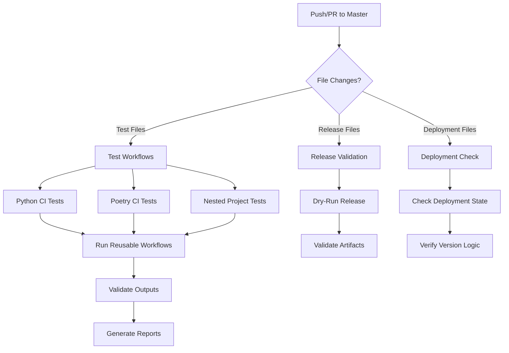

# Continuous Integration

This document covers the Continuous Integration (CI) workflows used to test and validate the reusable GitHub Actions workflows in this project.

## Overview

The CI system tests the reusable workflows themselves by running them against sample Python projects. All CI workflows follow the naming convention `test-*.yml` or `test_*.yaml`.

## CI Test Workflows

The project includes the following test workflows to validate the reusable workflows:

### 🧪 Testing Workflows

#### 1. **test_python_project_ci_multi-tests.yaml**
[](https://github.com/Chisanan232/GitHub-Action_Reusable_Workflows-Python/actions/workflows/test_python_project_ci_multi-tests.yaml)

Tests Python projects using pip/setup.py with multiple test types.

**Triggers:**
- Push/PR to master when relevant files change
- Tests workflows: `rw_get_tests`, `rw_run_test`, `rw_run_test_with_multi_py_versions`
- Tests coverage: `rw_organize_test_cov_reports`, `rw_upload_test_cov_report`
- Tests quality: `rw_sonarqube_scan`
- Tests deployment: `rw_pre-building_test`

**What it validates:**
- Multi-test type execution (unit, integration, etc.)
- Coverage report generation and upload
- SonarQube integration
- Pre-deployment testing

#### 2. **test_python_project_ci_one-test.yaml**
[](https://github.com/Chisanan232/GitHub-Action_Reusable_Workflows-Python/actions/workflows/test_python_project_ci_one-test.yaml)

Tests Python projects with a single test type using pip/setup.py.

**What it validates:**
- Single test type execution
- Basic CI workflow functionality
- Test discovery and execution

#### 3. **test_pyproject_ci_multi-tests_by_poetry.yaml**
[](https://github.com/Chisanan232/GitHub-Action_Reusable_Workflows-Python/actions/workflows/test_pyproject_ci_multi-tests_by_poetry.yaml)

Tests Poetry-based Python projects with multiple test types.

**Triggers:**
- Push/PR to master when relevant files change
- Tests workflows: `rw_get_tests`, `rw_poetry_run_test`, `rw_poetry_run_test_with_multi_py_versions`
- Tests coverage and quality workflows

**What it validates:**
- Poetry dependency management
- Multi-version testing with Poetry
- Poetry-specific workflow features

#### 4. **test_nested_pyproject_ci_multi-tests_by_poetry.yaml**
[](https://github.com/Chisanan232/GitHub-Action_Reusable_Workflows-Python/actions/workflows/test_nested_pyproject_ci_multi-tests_by_poetry.yaml)

Tests nested Poetry projects (projects within subdirectories).

**What it validates:**
- Nested project structure support
- Working directory configuration
- Poetry in non-root directories

### 🚀 Deployment & Release Workflows

#### 5. **test_checking_deployment_ci.yaml**
[](https://github.com/Chisanan232/GitHub-Action_Reusable_Workflows-Python/actions/workflows/test_checking_deployment_ci.yaml)

End-to-end test for deployment state checking.

**What it validates:**
- `rw_checking_deployment_state` workflow
- Version change detection
- Deployment decision logic

#### 6. **test_gh_reusable_workflow.yaml**
[](https://github.com/Chisanan232/GitHub-Action_Reusable_Workflows-Python/actions/workflows/test_gh_reusable_workflow.yaml)

Tests GitHub Action reusable workflow project CI.

**What it validates:**
- `rw_build_git-tag_and_create_github-release` workflow
- Git tag creation
- GitHub release creation
- Branch deployment logic

#### 7. **test-release-validate.yml**
[](https://github.com/Chisanan232/GitHub-Action_Reusable_Workflows-Python/actions/workflows/test-release-validate.yml)

Dry-run validation of the release process.

**Triggers:**
- Pull requests to master affecting release files
- Manual workflow dispatch with configuration options

**What it validates:**
- Release intent configuration
- Python package validation
- Docker image validation
- Documentation validation
- Multi-artifact release coordination

#### 8. **test-release-staging.yml**
[](https://github.com/Chisanan232/GitHub-Action_Reusable_Workflows-Python/actions/workflows/test-release-staging.yml)

Tests the staging release workflow.

**What it validates:**
- Staging release process
- Pre-production deployment
- Release artifact generation

## Workflow Architecture



## Common Trigger Patterns

All test workflows follow similar trigger patterns:

**Push/Pull Request Triggers:**
```yaml
on:
  push:
    branches:
      - "master"
    paths:
      - ".github/workflows/test_*.yaml"
      - ".github/workflows/rw_*.yaml"
      - "test/**"
      - "scripts/ci/**"
  pull_request:
    branches:
      - "master"
    paths:
      - # Same paths as push
```

**Benefits:**
- ✅ Only runs when relevant files change
- ✅ Tests both push and PR scenarios
- ✅ Validates workflow changes before merge
- ✅ Ensures reusable workflows work correctly

## Best Practices

### Testing Reusable Workflows

1. **Test Against Real Scenarios**: Each test workflow uses actual sample projects to validate functionality
2. **Path-Based Triggers**: Only run tests when relevant files change to save CI resources
3. **Comprehensive Validation**: Test multiple project types (pip, Poetry, nested)
4. **Output Verification**: Validate workflow outputs match expected results

### Adding New Test Workflows

When creating new test workflows:

1. Follow the naming convention: `test_*.yaml` or `test-*.yml`
2. Include path-based triggers for efficiency
3. Test both push and PR scenarios
4. Validate workflow outputs
5. Document what the test validates

---

## Navigation

- **🏠 [CI/CD Overview](/dev/next/ci-cd)** - Return to main CI/CD hub
- **🔄 [Release System](./release-system)** - Learn about releases and deployment
- **📚 [Documentation Deployment](./documentation-deployment)** - Documentation workflows
- **🛠️ [Developer Guide](./developer-guide)** - Configuration and troubleshooting
