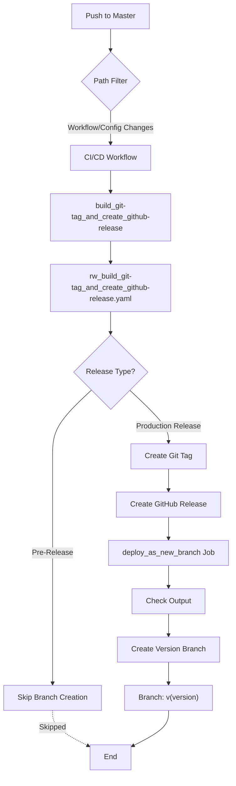

import TOCInline from '@theme/TOCInline';

# Release System


The GitHub Action Reusable Workflows for Python project uses an automated release system that creates Git tags, GitHub releases, and deployment branches based on release intent configuration.

<TOCInline toc={toc} />

## Overview

The release system is designed for managing reusable workflow releases with:

- **Intent-Driven Configuration**: YAML-based release configuration in `.github/tag_and_release/`
- **Automated Git Tagging**: Automatic version tag creation based on release intent
- **GitHub Release Creation**: Automated release notes and GitHub release publishing
- **Branch Deployment**: Creates version-specific branches for workflow consumption
- **Reusable Workflow Testing**: Validates workflows before release

## Main Release Workflow

### CI/CD Workflow ([`ci-cd.yaml`](https://github.com/Chisanan232/GitHub-Action_Reusable_Workflows-Python/blob/master/.github/workflows/ci-cd.yaml))

[](https://github.com/Chisanan232/GitHub-Action_Reusable_Workflows-Python/actions/workflows/ci-cd.yaml)

**Purpose**: Automated release management for reusable GitHub Actions workflows

**Triggers:**
- Push to `master` branch when:
  - Release configuration changes (`.github/tag_and_release/**`)
  - CI/CD workflow changes (`.github/workflows/ci-cd.yaml`)
  - Reusable workflow changes (`.github/workflows/rw_**.yaml`)
  - CI scripts change (`scripts/ci/**.sh`)

**Workflow Architecture:**



### Workflow Jobs

The CI/CD workflow consists of two main jobs:

#### Job 1: Build Git Tag and Create GitHub Release

```yaml
build_git-tag_and_create_github-release:
  uses: ./.github/workflows/rw_build_git-tag_and_create_github-release.yaml
  secrets:
    github_auth_token: ${{ secrets.GITHUB_TOKEN }}
  with:
    project_type: github-action-reusable-workflow
    debug_mode: false
```

**What it does:**
- Calls the reusable workflow `rw_build_git-tag_and_create_github-release.yaml`
- Reads release intent from `.github/tag_and_release/intent.yaml`
- Creates Git tags based on version configuration
- Generates GitHub releases with release notes
- Outputs release version information

**Outputs:**
- `github-action_reusable_workflow_release_version`: The release version type (e.g., "Production", "Pre-Release")

#### Job 2: Deploy as New Branch

```yaml
deploy_as_new_branch:
  needs: build_git-tag_and_create_github-release
  if: ${{ needs.build_git-tag_and_create_github-release.outputs.github-action_reusable_workflow_release_version != 'Pre-Release' }}
  runs-on: ubuntu-latest
  env:
    RELEASE_TYPE: ${{ needs.build_git-tag_and_create_github-release.outputs.github-action_reusable_workflow_release_version }}
    DEBUG_MODE: false
  steps:
    - uses: actions/checkout@v5
    
    - name: Check it whether get the output of previous one job which has version info or not
      run: bash scripts/ci/check_getting_output.sh
    
    - name: Create new git branch by the tagged commit
      run: bash ./scripts/ci/deployment_new_version_workflow.sh $DEBUG_MODE
```

**What it does:**
- Runs only if the release is NOT a pre-release
- Verifies the release version output from the previous job
- Creates a new Git branch based on the tagged commit
- Enables users to reference specific workflow versions (e.g., `@v1.0.0`)

## Release Intent Configuration

The release system uses a YAML-based configuration file located at `.github/tag_and_release/intent.yaml` to control release behavior.

### Configuration Structure

```yaml
# Release intent configuration
release: true              # Enable/disable release
level: "patch"            # Version bump level: patch, minor, major, or auto
artifacts:
  github-action-reusable-workflow: "auto"  # Release mode for workflows
notes: "Release notes describing changes"
```

### Release Levels

- **`patch`**: Bug fixes and minor updates (0.0.x)
- **`minor`**: New features, backward compatible (0.x.0)
- **`major`**: Breaking changes (x.0.0)
- **`auto`**: Automatically determine level based on changes

### Artifact Modes

- **`auto`**: Release if changes detected
- **`force`**: Always release
- **`skip`**: Skip release

## How Releases Work

### 1. Version Tagging

When changes are pushed to master:

1. The workflow reads `.github/tag_and_release/intent.yaml`
2. Determines if a release is needed based on configuration
3. Creates a Git tag with the new version (e.g., `v1.2.3`)
4. Pushes the tag to the repository

### 2. GitHub Release Creation

After tagging:

1. Reads release notes from `.github/tag_and_release/release-notes.md`
2. Creates a GitHub release with the tag
3. Attaches release notes and changelog
4. Marks as pre-release or production release

### 3. Branch Deployment

For production releases (not pre-releases):

1. Creates a new branch from the tagged commit
2. Branch name matches the version (e.g., `v1.2.3`)
3. Enables users to reference specific versions in their workflows:
   ```yaml
   uses: Chisanan232/GitHub-Action_Reusable_Workflows-Python/.github/workflows/rw_run_test.yaml@v1.2.3
   ```
