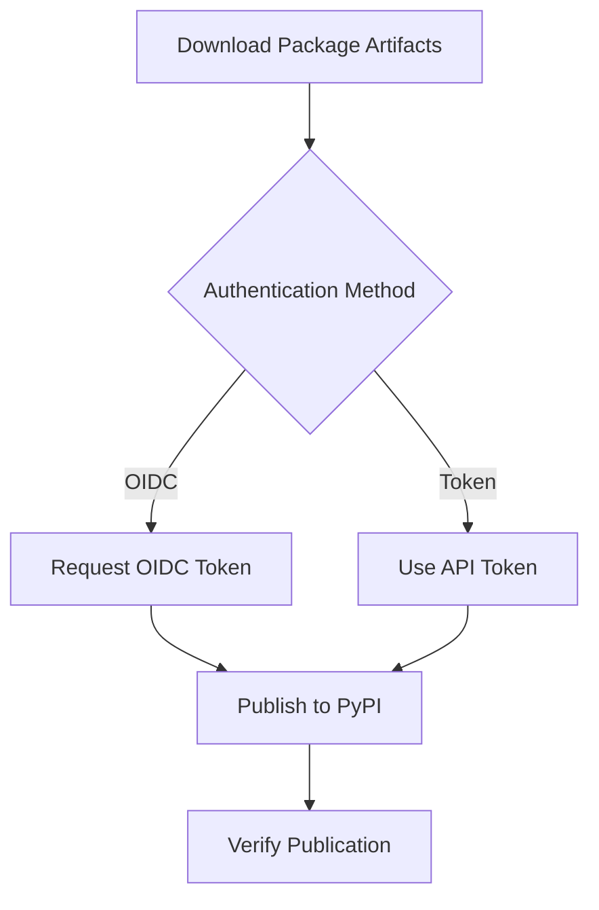

# PyPI Publish Workflow

[](https://github.com/Chisanan232/GitHub-Action_Reusable_Workflows-Python/blob/master/.github/workflows/rw_push_pypi.yaml)

Publish Python packages to PyPI (Python Package Index) or TestPyPI.

## Overview

This workflow publishes built Python packages to PyPI or TestPyPI using either OIDC (OpenID Connect) trusted publishing or API token authentication.

## When to Use

- ✅ You need to publish packages to PyPI
- ✅ You want to deploy to TestPyPI for testing
- ✅ You're automating package releases
- ✅ You need secure, automated publishing

## Workflow Architecture



## Inputs

### Required Inputs

None - uses artifacts from previous jobs

### Optional Inputs

| Input | Type | Default | Description |
|-------|------|---------|-------------|
| `repository` | string | `'pypi'` | Target repository (pypi, testpypi) |
| `auth_method` | string | `'oidc'` | Authentication method (oidc, token) |
| `package_path` | string | `'dist/'` | Path to package files |
| `skip_existing` | boolean | `false` | Skip if version already exists |
| `verify_metadata` | boolean | `true` | Verify package metadata before upload |

## Secrets

### For OIDC Authentication

No secrets required - uses GitHub OIDC tokens

### For Token Authentication

| Secret | Description |
|--------|-------------|
| `pypi_token` | PyPI API token |
| `test_pypi_token` | TestPyPI API token (if using TestPyPI) |

## Outputs

| Output | Description |
|--------|-------------|
| `package_url` | URL to published package on PyPI |
| `package_version` | Published package version |
| `publication_status` | Success or failure status |

## Usage Examples

### Basic Usage with OIDC (Recommended)

```yaml
name: Publish

on:
  release:
    types: [published]

permissions:
  id-token: write  # Required for OIDC
  contents: read

jobs:
  build:
    uses: Chisanan232/GitHub-Action_Reusable_Workflows-Python/.github/workflows/rw_python_package.yaml@master

  publish:
    needs: build
    uses: Chisanan232/GitHub-Action_Reusable_Workflows-Python/.github/workflows/rw_push_pypi.yaml@master
    with:
      repository: pypi
      auth_method: oidc
```

### Using API Token

```yaml
jobs:
  build:
    uses: Chisanan232/GitHub-Action_Reusable_Workflows-Python/.github/workflows/rw_python_package.yaml@master

  publish:
    needs: build
    uses: Chisanan232/GitHub-Action_Reusable_Workflows-Python/.github/workflows/rw_push_pypi.yaml@master
    secrets:
      pypi_token: ${{ secrets.PYPI_API_TOKEN }}
    with:
      repository: pypi
      auth_method: token
```

### Publish to TestPyPI

```yaml
jobs:
  build:
    uses: Chisanan232/GitHub-Action_Reusable_Workflows-Python/.github/workflows/rw_python_package.yaml@master

  test-publish:
    needs: build
    uses: Chisanan232/GitHub-Action_Reusable_Workflows-Python/.github/workflows/rw_push_pypi.yaml@master
    secrets:
      pypi_token: ${{ secrets.TEST_PYPI_API_TOKEN }}
    with:
      repository: testpypi
      auth_method: token
```

### Complete Release Pipeline

```yaml
name: Release

on:
  push:
    tags:
      - 'v*'

permissions:
  id-token: write
  contents: write

jobs:
  build:
    uses: Chisanan232/GitHub-Action_Reusable_Workflows-Python/.github/workflows/rw_python_package.yaml@master
    with:
      python_version: '3.11'
      validate_package: true

  test-publish:
    needs: build
    uses: Chisanan232/GitHub-Action_Reusable_Workflows-Python/.github/workflows/rw_push_pypi.yaml@master
    secrets:
      pypi_token: ${{ secrets.TEST_PYPI_API_TOKEN }}
    with:
      repository: testpypi
      auth_method: token

  publish:
    needs: test-publish
    uses: Chisanan232/GitHub-Action_Reusable_Workflows-Python/.github/workflows/rw_push_pypi.yaml@master
    with:
      repository: pypi
      auth_method: oidc
```

## How It Works

### Step 1: Download Artifacts

Downloads package distributions from build job:

```yaml
- uses: actions/download-artifact@v4
  with:
    name: python-package-distributions
    path: dist/
```

### Step 2: Verify Metadata

Validates package before upload:

```bash
twine check dist/*
```

### Step 3: Authenticate

#### OIDC Authentication

Requests OIDC token from GitHub:

```yaml
- uses: pypa/gh-action-pypi-publish@release/v1
  with:
    repository-url: https://upload.pypi.org/legacy/
```

#### Token Authentication

Uses provided API token:

```yaml
- uses: pypa/gh-action-pypi-publish@release/v1
  with:
    password: ${{ secrets.pypi_token }}
    repository-url: https://upload.pypi.org/legacy/
```

### Step 4: Upload Package

Uploads package to PyPI:

```bash
twine upload dist/*
```

### Step 5: Verify Publication

Confirms package is available:

```bash
pip index versions my-package
```

## Authentication Methods

### OIDC (Recommended)

**Advantages:**
- ✅ No secrets to manage
- ✅ More secure
- ✅ Automatic token rotation
- ✅ Scoped permissions

**Setup:**

1. Configure PyPI Trusted Publisher:
   - Go to PyPI → Account Settings → Publishing
   - Add GitHub as trusted publisher
   - Specify: `owner/repo`, workflow name, environment (optional)

2. Add permissions to workflow:
   ```yaml
   permissions:
     id-token: write
     contents: read
   ```

3. Use OIDC authentication:
   ```yaml
   with:
     auth_method: oidc
   ```

### Token Authentication

**Advantages:**
- ✅ Works with all PyPI-compatible repositories
- ✅ Simple setup
- ✅ Backward compatible

**Setup:**

1. Generate API token on PyPI:
   - Go to Account Settings → API tokens
   - Create token (project-scoped recommended)

2. Add token to GitHub Secrets:
   - Repository Settings → Secrets → Actions
   - Add `PYPI_API_TOKEN`

3. Use token authentication:
   ```yaml
   secrets:
     pypi_token: ${{ secrets.PYPI_API_TOKEN }}
   with:
     auth_method: token
   ```

## Repository Targets

### PyPI (Production)

Main Python Package Index:

```yaml
repository: pypi
```

**URL:** https://pypi.org/  
**Upload URL:** https://upload.pypi.org/legacy/

### TestPyPI (Testing)

Testing environment:

```yaml
repository: testpypi
```

**URL:** https://test.pypi.org/  
**Upload URL:** https://test.pypi.org/legacy/

**Testing installation:**
```bash
pip install --index-url https://test.pypi.org/simple/ my-package
```

## Best Practices

### 1. Test Before Production

Always test on TestPyPI first:

```yaml
jobs:
  test-publish:
    uses: ./.github/workflows/rw_push_pypi.yaml
    with:
      repository: testpypi

  publish:
    needs: test-publish
    uses: ./.github/workflows/rw_push_pypi.yaml
    with:
      repository: pypi
```

### 2. Use OIDC When Possible

Prefer OIDC over tokens:

```yaml
permissions:
  id-token: write

with:
  auth_method: oidc
```

### 3. Verify Metadata

Always verify before upload:

```yaml
with:
  verify_metadata: true
```

### 4. Version Management

Ensure unique versions:

```toml
[project]
version = "1.0.0"  # Increment for each release
```

### 5. Skip Existing Versions

Prevent re-upload errors:

```yaml
with:
  skip_existing: true
```

## Troubleshooting

### OIDC Authentication Fails

**Symptoms:**
- "OIDC token validation failed"
- Permission denied errors

**Solutions:**
1. Verify PyPI trusted publisher configuration:
   - Repository name matches exactly
   - Workflow filename is correct
   - Environment name matches (if specified)

2. Check workflow permissions:
   ```yaml
   permissions:
     id-token: write
   ```

3. Ensure using correct PyPI account

### Token Authentication Fails

**Symptoms:**
- "Invalid credentials"
- "Authentication failed"

**Solutions:**
1. Verify token is correct:
   - Check token hasn't expired
   - Ensure token has correct scope

2. Check secret name:
   ```yaml
   secrets:
     pypi_token: ${{ secrets.PYPI_API_TOKEN }}
   ```

3. Regenerate token if necessary

### Version Already Exists

**Symptoms:**
- "File already exists" error
- Upload rejected

**Solutions:**
1. Increment version number:
   ```toml
   version = "1.0.1"  # Bump version
   ```

2. Use skip_existing:
   ```yaml
   with:
     skip_existing: true
   ```

3. Delete old version from PyPI (not recommended)

### Package Upload Fails

**Symptoms:**
- Upload times out
- Network errors

**Solutions:**
1. Check package size (PyPI has limits)
2. Verify network connectivity
3. Retry upload
4. Check PyPI status page

## Package Verification

### After Publication

Verify package is available:

```bash
# Check package exists
pip index versions my-package

# Install and test
pip install my-package
python -c "import my_package; print(my_package.__version__)"
```

### Metadata Verification

Check package page on PyPI:
- Description renders correctly
- Links work
- Classifiers are correct
- Version is correct

## Security Considerations

### 1. Token Security

- ✅ Use project-scoped tokens
- ✅ Rotate tokens regularly
- ✅ Never commit tokens to repository
- ✅ Use GitHub Secrets for storage

### 2. OIDC Security

- ✅ Configure trusted publishers correctly
- ✅ Use environment protection rules
- ✅ Limit workflow permissions
- ✅ Review OIDC claims

### 3. Package Security

- ✅ Sign packages (optional)
- ✅ Use HTTPS for uploads
- ✅ Verify package integrity
- ✅ Enable 2FA on PyPI account

## Related Workflows

- [rw_python_package](rw_python_package.mdx) - Build packages
- [rw_pre-building_test](rw_pre-building_test.mdx) - Test package installation
- [rw_checking_deployment_state](rw_checking_deployment_state.mdx) - Check deployment state
- [rw_release_complete](../release/rw_release_complete.mdx) - Complete release process

## Additional Resources

- [PyPI Documentation](https://pypi.org/help/)
- [PyPI Trusted Publishers](https://docs.pypi.org/trusted-publishers/)
- [Twine Documentation](https://twine.readthedocs.io/)
- [GitHub OIDC](https://docs.github.com/en/actions/deployment/security-hardening-your-deployments/about-security-hardening-with-openid-connect)
