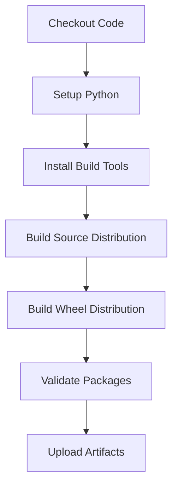

# Python Package Build Workflow

[](https://github.com/Chisanan232/GitHub-Action_Reusable_Workflows-Python/blob/master/.github/workflows/rw_python_package.yaml)

Build Python package distributions (wheel and source distribution).

## Overview

This workflow builds Python package artifacts using modern Python packaging tools, creating both wheel (`.whl`) and source distribution (`.tar.gz`) files ready for publishing to PyPI or other package indexes.

## When to Use

- ✅ You need to build Python package distributions
- ✅ You're preparing for PyPI publication
- ✅ You want to create distributable package artifacts
- ✅ You need to validate package build process

## Workflow Architecture



## Inputs

### Required Inputs

None - uses repository defaults

### Optional Inputs

| Input | Type | Default | Description |
|-------|------|---------|-------------|
| `python_version` | string | `'3.11'` | Python version for building |
| `build_tool` | string | `'build'` | Build tool (build, setuptools, poetry) |
| `build_args` | string | `''` | Additional build arguments |
| `validate_package` | boolean | `true` | Run package validation checks |

## Outputs

| Output | Description |
|--------|-------------|
| `wheel_path` | Path to built wheel file |
| `sdist_path` | Path to built source distribution |
| `package_version` | Extracted package version |
| `artifact_name` | Name of uploaded artifact |

## Usage Examples

### Basic Usage

```yaml
name: Build

on: [push, pull_request]

jobs:
  build:
    uses: Chisanan232/GitHub-Action_Reusable_Workflows-Python/.github/workflows/rw_python_package.yaml@master
```

### With Custom Python Version

```yaml
jobs:
  build:
    uses: Chisanan232/GitHub-Action_Reusable_Workflows-Python/.github/workflows/rw_python_package.yaml@master
    with:
      python_version: '3.12'
```

### Using Poetry

```yaml
jobs:
  build:
    uses: Chisanan232/GitHub-Action_Reusable_Workflows-Python/.github/workflows/rw_python_package.yaml@master
    with:
      build_tool: poetry
      python_version: '3.11'
```

### Complete Build and Publish Pipeline

```yaml
name: Build and Publish

on:
  push:
    tags:
      - 'v*'

jobs:
  build:
    uses: Chisanan232/GitHub-Action_Reusable_Workflows-Python/.github/workflows/rw_python_package.yaml@master
    with:
      python_version: '3.11'
      validate_package: true

  publish:
    needs: build
    uses: Chisanan232/GitHub-Action_Reusable_Workflows-Python/.github/workflows/rw_push_pypi.yaml@master
    secrets:
      pypi_token: ${{ secrets.PYPI_API_TOKEN }}
```

## How It Works

### Step 1: Environment Setup

Sets up Python and installs build tools:

```yaml
- uses: actions/checkout@v4
- uses: actions/setup-python@v5
  with:
    python-version: ${{ inputs.python_version }}

- name: Install build tools
  run: |
    python -m pip install --upgrade pip
    pip install build twine check-manifest
```

### Step 2: Build Source Distribution

Creates source distribution (`.tar.gz`):

```bash
python -m build --sdist
```

### Step 3: Build Wheel

Creates wheel distribution (`.whl`):

```bash
python -m build --wheel
```

### Step 4: Package Validation

Validates built packages:

```bash
twine check dist/*
check-manifest
```

### Step 5: Upload Artifacts

Uploads built packages as artifacts:

```yaml
- uses: actions/upload-artifact@v4
  with:
    name: python-package-distributions
    path: dist/
```

## Build Tools

### Python Build (Default)

Modern PEP 517 compliant build tool:

```yaml
build_tool: build
```

**Advantages:**
- Standard Python packaging
- PEP 517/518 compliant
- Works with any build backend

**Requirements:**
```toml
[build-system]
requires = ["setuptools>=45", "wheel", "setuptools_scm[toml]>=6.2"]
build-backend = "setuptools.build_meta"
```

### Poetry

Poetry-based package building:

```yaml
build_tool: poetry
```

**Advantages:**
- Integrated dependency management
- Lock file support
- Modern packaging

**Requirements:**
```toml
[build-system]
requires = ["poetry-core>=1.0.0"]
build-backend = "poetry.core.masonry.api"
```

### Setuptools

Traditional setuptools building:

```yaml
build_tool: setuptools
```

**Advantages:**
- Wide compatibility
- Well-established
- Flexible configuration

## Package Configuration

### pyproject.toml (Recommended)

Modern Python packaging configuration:

```toml
[build-system]
requires = ["setuptools>=45", "wheel"]
build-backend = "setuptools.build_meta"

[project]
name = "my-package"
version = "1.0.0"
description = "My Python package"
authors = [
    {name = "Your Name", email = "you@example.com"}
]
dependencies = [
    "requests>=2.28.0",
]
requires-python = ">=3.9"

[project.optional-dependencies]
dev = [
    "pytest>=7.0.0",
    "pytest-cov>=4.0.0",
]
```

### setup.py (Legacy)

Traditional setup.py configuration:

```python
from setuptools import setup, find_packages

setup(
    name="my-package",
    version="1.0.0",
    packages=find_packages(where="src"),
    package_dir={"": "src"},
    install_requires=[
        "requests>=2.28.0",
    ],
    python_requires=">=3.9",
)
```

## Package Validation

### Twine Check

Validates package metadata and structure:

```bash
twine check dist/*
```

Checks:
- README rendering
- Metadata completeness
- Package structure
- File integrity

### Check-Manifest

Verifies MANIFEST.in completeness:

```bash
check-manifest
```

Ensures all necessary files are included in source distribution.

### Package Structure Validation

Validates package can be installed:

```bash
pip install dist/*.whl
python -c "import my_package; print(my_package.__version__)"
```

## Best Practices

### 1. Version Management

Use dynamic versioning:

```toml
[project]
dynamic = ["version"]

[tool.setuptools.dynamic]
version = {attr = "my_package.__version__"}
```

Or use setuptools_scm:

```toml
[build-system]
requires = ["setuptools>=45", "setuptools_scm[toml]>=6.2"]

[tool.setuptools_scm]
write_to = "src/my_package/_version.py"
```

### 2. Include Necessary Files

Create `MANIFEST.in`:

```
include README.md
include LICENSE
include pyproject.toml
recursive-include src *.py
recursive-include tests *.py
```

### 3. Package Metadata

Provide complete metadata:

```toml
[project]
name = "my-package"
version = "1.0.0"
description = "A short description"
readme = "README.md"
license = {text = "MIT"}
authors = [{name = "Your Name", email = "you@example.com"}]
keywords = ["keyword1", "keyword2"]
classifiers = [
    "Development Status :: 4 - Beta",
    "Intended Audience :: Developers",
    "License :: OSI Approved :: MIT License",
    "Programming Language :: Python :: 3",
    "Programming Language :: Python :: 3.9",
    "Programming Language :: Python :: 3.10",
    "Programming Language :: Python :: 3.11",
    "Programming Language :: Python :: 3.12",
]
```

### 4. Clean Build Environment

Ensure clean builds:

```bash
# Remove old builds
rm -rf dist/ build/ *.egg-info/

# Build fresh
python -m build
```

## Troubleshooting

### Build Fails

**Symptoms:**
- Build command fails
- Missing dependencies

**Solutions:**
1. Check `pyproject.toml` syntax:
   ```bash
   python -m build --sdist --wheel
   ```

2. Verify build dependencies:
   ```toml
   [build-system]
   requires = ["setuptools>=45", "wheel"]
   ```

3. Review build logs for errors

### Package Validation Fails

**Symptoms:**
- Twine check fails
- Invalid metadata

**Solutions:**
1. Fix README rendering:
   ```toml
   [project]
   readme = {file = "README.md", content-type = "text/markdown"}
   ```

2. Complete required metadata:
   ```toml
   [project]
   name = "my-package"
   version = "1.0.0"
   description = "Required description"
   ```

3. Check file includes in MANIFEST.in

### Missing Files in Distribution

**Symptoms:**
- Files missing from built package
- Import errors after installation

**Solutions:**
1. Update MANIFEST.in:
   ```
   recursive-include src *.py
   include README.md LICENSE
   ```

2. Use check-manifest:
   ```bash
   check-manifest
   ```

3. Verify package_data in pyproject.toml:
   ```toml
   [tool.setuptools.package-data]
   my_package = ["data/*.json", "templates/*.html"]
   ```

## Package Distribution Types

### Wheel Distribution (.whl)

Binary distribution format:

**Advantages:**
- Faster installation
- No build step required
- Platform-specific optimizations

**File naming:**
```
my_package-1.0.0-py3-none-any.whl
```

### Source Distribution (.tar.gz)

Source code distribution:

**Advantages:**
- Platform independent
- Includes all source files
- Can be built on any platform

**File naming:**
```
my-package-1.0.0.tar.gz
```

## Related Workflows

- [rw_push_pypi](rw_push_pypi.mdx) - Publish to PyPI
- [rw_pre-building_test](rw_pre-building_test.mdx) - Test package installation
- [rw_checking_deployment_state](rw_checking_deployment_state.mdx) - Check deployment readiness

## Additional Resources

- [Python Packaging Guide](https://packaging.python.org/)
- [PEP 517 - Build System](https://peps.python.org/pep-0517/)
- [PEP 518 - pyproject.toml](https://peps.python.org/pep-0518/)
- [Setuptools Documentation](https://setuptools.pypa.io/)
- [Poetry Documentation](https://python-poetry.org/)
