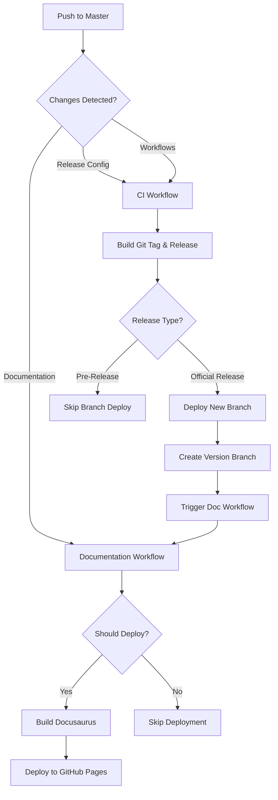

# CI/CD Features Overview

This section documents the complete CI/CD pipeline architecture used in the GitHub Action Reusable Workflows project, including workflow orchestration, release management, and documentation deployment.

## CI/CD Architecture

The project uses a sophisticated CI/CD pipeline that automates:
- **Release Management** - Automatic versioning, tagging, and GitHub releases
- **Branch Deployment** - Creating versioned branches for stable releases
- **Documentation** - Building and deploying documentation to GitHub Pages
- **Quality Assurance** - Ensuring code quality and consistency

## Core CI/CD Workflows

### 1. Main CI Workflow (`ci-cd.yaml`)

The primary CI workflow handles release automation and branch deployment.

**Triggers:**
- Push to `master` branch
- Changes to:
  - `.github/tag_and_release/**` - Release configuration
  - `.github/workflows/ci-cd.yaml` - CI workflow itself
  - `.github/workflows/rw_**.yaml` - Reusable workflows
  - `scripts/ci/**.sh` - CI scripts

**Jobs:**
1. **Build Git Tag and Create GitHub Release**
   - Uses: `rw_build_git-tag_and_create_github-release.yaml`
   - Automatically creates Git tags and GitHub releases
   - Determines release type based on configuration

2. **Deploy as New Branch**
   - Creates a new Git branch from the tagged commit
   - Only runs for non-pre-release versions
   - Enables version-specific workflow references

### 2. Documentation Workflow (`documentation.yaml`)

Handles documentation building and deployment to GitHub Pages.

**Triggers:**
- Push to `master` branch with documentation changes
- Completion of release workflow (via `workflow_run`)

**Features:**
- Smart change detection (only deploys when docs change)
- Docusaurus build with caching
- GitHub Pages deployment
- Multi-section documentation support

## Workflow Sequence



## Release Configuration

The CI/CD pipeline is controlled by the `intent.yaml` file located in `.github/tag_and_release/`.

### Key Configuration Sections

#### Release Control
```yaml
release: true
level: patch  # auto | patch | minor | major
```

#### Artifact Management
```yaml
artifacts:
  python: auto  # auto | force | skip
  docker: auto
  docs:
    mode: auto
    sections:
      - docs
      - dev
    strategy: always  # changed | always
```

#### Project Settings
```yaml
project:
  name: ~
  package_name: ~
  base_branch: master
```

## CI/CD Features

### 🔄 Automatic Versioning
- Semantic versioning based on configuration
- Automatic version detection from changes
- Support for pre-releases and official releases

### 🏷️ Git Tag Management
- Automatic Git tag creation
- Tag format: `v{major}.{minor}.{patch}`
- Linked to GitHub releases

### 📦 Release Artifacts
- GitHub release creation with notes
- Automatic release asset uploads
- Multi-artifact support (Python, Docker, Docs)

### 🌿 Branch Deployment
- Version-specific branches (e.g., `v1.0.0`)
- Enables pinned workflow references
- Maintains stable workflow versions

### 📚 Documentation Versioning
- Multi-section documentation support
- Automatic versioning on release
- GitHub Pages deployment
- Smart change detection

### 🔐 Security Features
- OIDC authentication support for PyPI
- Token-based authentication fallback
- Secure secret management
- GitHub token permissions

## Workflow Dependencies

The CI/CD pipeline relies on several reusable workflows:

| Workflow | Purpose | Documentation |
|----------|---------|---------------|
| `rw_build_git-tag_and_create_github-release.yaml` | Create releases | [View](../workflows/index.mdx) |
| `rw_parse_project_config.yaml` | Parse intent.yaml | [View](../workflows/index.mdx) |
| `rw_parse_release_intent.yaml` | Parse release notes | [View](../workflows/index.mdx) |
| `rw_documentation_deployment.yaml` | Deploy docs | [View](../workflows/index.mdx) |

## Environment Variables

### CI Workflow
- `RELEASE_TYPE` - Type of release (Official-Release, Pre-Release, etc.)
- `DEBUG_MODE` - Enable debug output (true/false)
- `GITHUB_TOKEN` - Automatic GitHub authentication token

### Documentation Workflow
- `NODE_VERSION` - Node.js version for building (22)
- `PNPM_VERSION` - pnpm version (10)

## Permissions

### CI Workflow
```yaml
permissions:
  contents: write  # For creating tags and branches
  id-token: write  # For OIDC authentication
```

### Documentation Workflow
```yaml
permissions:
  contents: write  # For checking out code
  id-token: write  # For GitHub Pages OIDC
  pages: write     # For deploying to Pages
```

## Best Practices

1. **Release Configuration**
   - Keep `intent.yaml` up to date
   - Use semantic versioning
   - Document release notes clearly

2. **Branch Management**
   - Don't manually modify version branches
   - Use version branches for stable references
   - Keep master branch as development branch

3. **Documentation**
   - Update docs before releasing
   - Test documentation builds locally
   - Verify links and references

4. **Security**
   - Use OIDC when possible
   - Rotate tokens regularly
   - Review permissions carefully

## Troubleshooting

### Release Not Created
- Check `intent.yaml` has `release: true`
- Verify changes trigger the workflow
- Review workflow logs for errors

### Branch Not Deployed
- Ensure release is not a pre-release
- Check `RELEASE_TYPE` output
- Verify script permissions

### Documentation Not Deployed
- Check if documentation files changed
- Verify GitHub Pages is enabled
- Review build logs for errors

## Related Documentation

- [Release Management](./release-management.mdx) - Detailed release process
- [Documentation Pipeline](./documentation-pipeline.mdx) - Documentation workflow details
- [Configuration Reference](./configuration-reference.mdx) - Complete intent.yaml reference
- [Workflows Overview](./index.mdx) - All reusable workflows
