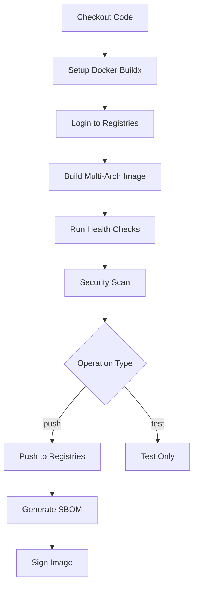

# Docker Operations Workflow

[](https://github.com/Chisanan232/GitHub-Action_Reusable_Workflows-Python/blob/master/.github/workflows/rw_docker_operations.yaml)

Build, test, and publish Docker images to container registries.

## Overview

This workflow handles complete Docker operations including building multi-architecture images, running health checks, security scanning, and publishing to Docker Hub and GitHub Container Registry (GHCR).

## When to Use

- ✅ You need to build Docker images
- ✅ You want to publish to Docker registries
- ✅ You need multi-architecture support (amd64, arm64)
- ✅ You want automated security scanning

## Workflow Architecture



## Inputs

### Required Inputs

| Input | Type | Description |
|-------|------|-------------|
| `operation` | string | Operation type (build, push, test) |
| `registry` | string | Target registry (dockerhub, ghcr, both) |
| `version` | string | Image version tag |

### Optional Inputs

| Input | Type | Default | Description |
|-------|------|---------|-------------|
| `dockerfile_path` | string | `'Dockerfile'` | Path to Dockerfile |
| `context_path` | string | `'.'` | Build context path |
| `platforms` | string | `'linux/amd64,linux/arm64'` | Target platforms |
| `health_check_port` | string | `'8000'` | Health check port |
| `health_check_path` | string | `'/health'` | Health check endpoint |
| `docker_run_options` | string | `''` | Additional docker run options |
| `security_scan` | boolean | `true` | Run security scanning |
| `generate_sbom` | boolean | `true` | Generate SBOM |
| `sign_image` | boolean | `false` | Sign image with Cosign |

## Secrets

| Secret | Required | Description |
|--------|----------|-------------|
| `dockerhub_username` | For DockerHub | Docker Hub username |
| `dockerhub_token` | For DockerHub | Docker Hub access token |
| `github_token` | For GHCR | GitHub token (auto-provided) |

## Outputs

| Output | Description |
|--------|-------------|
| `image_digest` | Image digest (SHA256) |
| `image_tags` | List of applied tags |
| `scan_results` | Security scan results |
| `sbom_path` | Path to SBOM file |

## Usage Examples

### Basic Build and Push

```yaml
name: Docker

on:
  push:
    branches: [main]

jobs:
  docker:
    uses: Chisanan232/GitHub-Action_Reusable_Workflows-Python/.github/workflows/rw_docker_operations.yaml@master
    secrets:
      dockerhub_username: ${{ secrets.DOCKERHUB_USERNAME }}
      dockerhub_token: ${{ secrets.DOCKERHUB_TOKEN }}
    with:
      operation: push
      registry: dockerhub
      version: latest
```

### Multi-Registry Publishing

```yaml
jobs:
  docker:
    uses: Chisanan232/GitHub-Action_Reusable_Workflows-Python/.github/workflows/rw_docker_operations.yaml@master
    secrets:
      dockerhub_username: ${{ secrets.DOCKERHUB_USERNAME }}
      dockerhub_token: ${{ secrets.DOCKERHUB_TOKEN }}
    with:
      operation: push
      registry: both  # Push to both DockerHub and GHCR
      version: ${{ github.ref_name }}
```

### With Security Scanning

```yaml
jobs:
  docker:
    uses: Chisanan232/GitHub-Action_Reusable_Workflows-Python/.github/workflows/rw_docker_operations.yaml@master
    secrets:
      dockerhub_username: ${{ secrets.DOCKERHUB_USERNAME }}
      dockerhub_token: ${{ secrets.DOCKERHUB_TOKEN }}
    with:
      operation: push
      registry: dockerhub
      version: v1.0.0
      security_scan: true
      generate_sbom: true
      sign_image: true
```

### Custom Health Check

```yaml
jobs:
  docker:
    uses: Chisanan232/GitHub-Action_Reusable_Workflows-Python/.github/workflows/rw_docker_operations.yaml@master
    secrets:
      dockerhub_username: ${{ secrets.DOCKERHUB_USERNAME }}
      dockerhub_token: ${{ secrets.DOCKERHUB_TOKEN }}
    with:
      operation: push
      registry: ghcr
      version: latest
      health_check_port: '3000'
      health_check_path: '/api/health'
      docker_run_options: '-e NODE_ENV=production -e API_KEY=test'
```

## How It Works

### Step 1: Setup Docker Buildx

Configures Docker Buildx for multi-platform builds:

```yaml
- uses: docker/setup-buildx-action@v3
  with:
    platforms: linux/amd64,linux/arm64
```

### Step 2: Registry Authentication

Logs in to target registries:

```yaml
# Docker Hub
- uses: docker/login-action@v3
  with:
    username: ${{ secrets.dockerhub_username }}
    password: ${{ secrets.dockerhub_token }}

# GHCR
- uses: docker/login-action@v3
  with:
    registry: ghcr.io
    username: ${{ github.actor }}
    password: ${{ secrets.GITHUB_TOKEN }}
```

### Step 3: Build Image

Builds multi-architecture image:

```yaml
- uses: docker/build-push-action@v5
  with:
    context: ${{ inputs.context_path }}
    file: ${{ inputs.dockerfile_path }}
    platforms: ${{ inputs.platforms }}
    tags: |
      user/repo:${{ inputs.version }}
      user/repo:latest
    push: ${{ inputs.operation == 'push' }}
    cache-from: type=gha
    cache-to: type=gha,mode=max
```

### Step 4: Health Check

Tests container health:

```bash
docker run -d -p $PORT:$PORT $IMAGE
sleep 5
curl -f http://localhost:$PORT$PATH || exit 1
```

### Step 5: Security Scan

Scans for vulnerabilities:

```yaml
- uses: aquasecurity/trivy-action@master
  with:
    image-ref: ${{ inputs.registry }}/${{ inputs.version }}
    format: 'sarif'
    output: 'trivy-results.sarif'
```

### Step 6: Generate SBOM

Creates Software Bill of Materials:

```bash
syft $IMAGE -o spdx-json > sbom.json
```

### Step 7: Sign Image (Optional)

Signs image with Cosign:

```bash
cosign sign --yes $IMAGE@$DIGEST
```

## Operation Types

### Build

Build image without pushing:

```yaml
operation: build
```

- Builds image
- Runs tests
- No registry push

### Push

Build and push to registry:

```yaml
operation: push
```

- Builds image
- Runs tests
- Pushes to registry
- Generates SBOM
- Signs image (if enabled)

### Test

Test existing image:

```yaml
operation: test
```

- Pulls image
- Runs health checks
- Security scanning

## Registry Options

### Docker Hub

```yaml
registry: dockerhub
```

**Image naming:**
```
username/repository:version
```

**Requirements:**
- `dockerhub_username` secret
- `dockerhub_token` secret

### GitHub Container Registry

```yaml
registry: ghcr
```

**Image naming:**
```
ghcr.io/owner/repository:version
```

**Requirements:**
- `GITHUB_TOKEN` (auto-provided)

### Both Registries

```yaml
registry: both
```

Pushes to both Docker Hub and GHCR simultaneously.

## Multi-Architecture Support

### Supported Platforms

Default platforms:
- `linux/amd64` - x86_64 architecture
- `linux/arm64` - ARM64 architecture

### Custom Platforms

```yaml
platforms: 'linux/amd64,linux/arm64,linux/arm/v7'
```

### Platform-Specific Builds

```yaml
# AMD64 only
platforms: 'linux/amd64'

# ARM64 only
platforms: 'linux/arm64'
```

## Best Practices

### 1. Multi-Stage Builds

Use multi-stage Dockerfiles:

```dockerfile
# Build stage
FROM python:3.11-slim as builder
WORKDIR /app
COPY requirements.txt .
RUN pip install --user -r requirements.txt

# Runtime stage
FROM python:3.11-slim
WORKDIR /app
COPY --from=builder /root/.local /root/.local
COPY .. .
ENV PATH=/root/.local/bin:$PATH
CMD ["python", "app.py"]
```

### 2. Layer Caching

Optimize layer caching:

```dockerfile
# Copy requirements first (changes less frequently)
COPY requirements.txt .
RUN pip install -r requirements.txt

# Copy code last (changes frequently)
COPY . .
```

### 3. Health Checks

Include health check in Dockerfile:

```dockerfile
HEALTHCHECK --interval=30s --timeout=3s --start-period=5s --retries=3 \
  CMD curl -f http://localhost:8000/health || exit 1
```

### 4. Security

- Use specific base image versions
- Run as non-root user
- Scan for vulnerabilities
- Keep images minimal

```dockerfile
FROM python:3.11-slim

# Create non-root user
RUN useradd -m -u 1000 appuser
USER appuser

WORKDIR /app
COPY --chown=appuser:appuser . .

CMD ["python", "app.py"]
```

### 5. Image Tagging

Use semantic versioning:

```yaml
tags: |
  user/repo:${{ github.ref_name }}
  user/repo:latest
  user/repo:${{ github.sha }}
```

## Troubleshooting

### Build Fails

**Symptoms:**
- Docker build errors
- Dependency installation fails

**Solutions:**
1. Check Dockerfile syntax
2. Verify base image exists
3. Review build logs
4. Test build locally:
   ```bash
   docker build -t test .
   ```

### Multi-Arch Build Fails

**Symptoms:**
- Platform-specific errors
- QEMU errors

**Solutions:**
1. Verify platform support:
   ```yaml
   platforms: 'linux/amd64'  # Start with single platform
   ```

2. Check base image supports target platforms

3. Use platform-specific instructions:
   ```dockerfile
   FROM --platform=$BUILDPLATFORM python:3.11-slim
   ```

### Health Check Fails

**Symptoms:**
- Container starts but health check fails
- Timeout errors

**Solutions:**
1. Verify port mapping:
   ```yaml
   health_check_port: '8000'
   ```

2. Check health endpoint exists:
   ```bash
   curl http://localhost:8000/health
   ```

3. Increase startup time:
   ```yaml
   docker_run_options: '--health-start-period=30s'
   ```

### Registry Push Fails

**Symptoms:**
- Authentication errors
- Permission denied

**Solutions:**
1. Verify credentials:
   ```yaml
   secrets:
     dockerhub_username: ${{ secrets.DOCKERHUB_USERNAME }}
     dockerhub_token: ${{ secrets.DOCKERHUB_TOKEN }}
   ```

2. Check repository exists

3. Verify token permissions

## Security Scanning

### Trivy Scanning

Scans for:
- OS vulnerabilities
- Application dependencies
- Misconfigurations
- Secrets in image

### SBOM Generation

Creates Software Bill of Materials:

```json
{
  "artifacts": [
    {
      "name": "python",
      "version": "3.11.0",
      "type": "python-pkg"
    }
  ]
}
```

### Image Signing

Signs images with Cosign:

```bash
# Verify signed image
cosign verify $IMAGE
```

## Related Workflows

- [rw_release_complete](../release/rw_release_complete.mdx) - Complete release with Docker
- [rw_release_staging_complete](../release/rw_release_staging_complete.mdx) - Staging with Docker
- [rw_release_validation_complete](../release/rw_release_validation_complete.mdx) - Validation with Docker

## Additional Resources

- [Docker Documentation](https://docs.docker.com/)
- [Docker Buildx](https://docs.docker.com/buildx/working-with-buildx/)
- [Multi-Platform Images](https://docs.docker.com/build/building/multi-platform/)
- [Trivy Scanner](https://aquasecurity.github.io/trivy/)
- [Cosign](https://docs.sigstore.dev/cosign/overview/)
