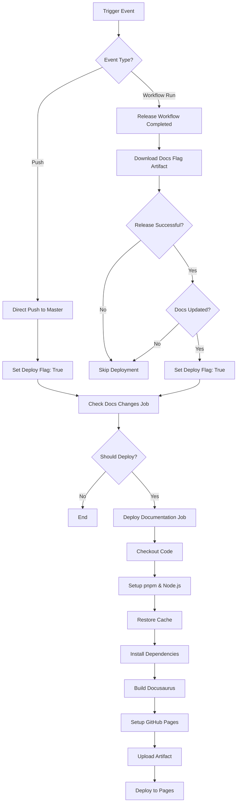

# Documentation Pipeline

This document explains the automated documentation building and deployment pipeline used in the project.

## Overview

The documentation pipeline automatically builds and deploys documentation to GitHub Pages whenever documentation files are updated or a release is created.

## Documentation Workflow Architecture



## Trigger Conditions

### 1. Direct Push Events

The workflow triggers on push to `master` when these files change:

**CI Workflow Files:**
- `.github/workflows/documentation.yaml`
- `scripts/ci/**documentation**.sh`

**Frontend Configuration:**
- `docs/package.json`
- `docs/pnpm-lock.yaml`

**Docusaurus Configuration:**
- `docs/docusaurus.config.ts`

**Documentation Content:**
- `docs/**/*.md`
- `docs/**/*.mdx`
- `docs/**/*.ts`
- `docs/**/*.tsx`
- `docs/**/*.js`
- `docs/**/*.jsx`
- `docs/**/*.css`

**Versioning Files:**
- `docs/*_versions.json`
- `docs/*_versioned_docs/**`
- `docs/*_versioned_sidebars/**`

### 2. Workflow Run Events

Triggers when the `release` workflow completes:

```yaml
workflow_run:
  workflows: ["release"]
  types: [completed]
  branches: ["master"]
```

This enables documentation deployment after successful releases.

## Workflow Jobs

### Job 1: Check Documentation Changes

**Purpose:** Determine if documentation should be deployed

**Outputs:**
- `should_deploy` - Boolean flag indicating deployment necessity

#### For Push Events

```yaml
- name: Set deployment flag for push events
  if: github.event_name == 'push'
  run: |
    echo "Direct push event detected, proceeding with deployment"
    echo "should_deploy=true" >> $GITHUB_OUTPUT
```

Always deploys when documentation files are directly pushed.

#### For Workflow Run Events

```yaml
- name: Download docs update flag from release workflow
  uses: actions/download-artifact@v5
  with:
    name: release-docs-flag
    github-token: ${{ secrets.GITHUB_TOKEN }}
    run-id: ${{ github.event.workflow_run.id }}

- name: Check release workflow success and docs update flag
  run: |
    # Verify release workflow succeeded
    if [[ "${{ github.event.workflow_run.conclusion }}" != "success" ]]; then
      echo "should_deploy=false" >> $GITHUB_OUTPUT
      exit 0
    fi
    
    # Read docs update flag from artifact
    DOCS_UPDATED=$(cat docs_updated.txt)
    
    if [[ "$DOCS_UPDATED" == "true" ]]; then
      echo "should_deploy=true" >> $GITHUB_OUTPUT
    else
      echo "should_deploy=false" >> $GITHUB_OUTPUT
    fi
```

Only deploys if:
1. Release workflow succeeded
2. Documentation files were updated during release

### Job 2: Deploy Documentation

**Purpose:** Build and deploy documentation to GitHub Pages

**Condition:** Runs only if `should_deploy == true`

#### Step-by-Step Process

##### 1. Checkout Code

```yaml
- name: Checkout
  uses: actions/checkout@v5
  with:
    fetch-depth: 0  # Full history for versioning
```

Fetches complete Git history for documentation versioning.

##### 2. Setup pnpm

```yaml
- name: Install pnpm
  uses: pnpm/action-setup@v4
  with:
    version: 10
    run_install: false
```

Installs pnpm package manager (faster than npm).

##### 3. Setup Node.js

```yaml
- name: Setup Node.js
  uses: actions/setup-node@v6
  with:
    node-version: '22'
    cache: 'pnpm'
    cache-dependency-path: docs/pnpm-lock.yaml
```

Configures Node.js with pnpm caching for faster builds.

##### 4. Cache Docusaurus Build

```yaml
- name: Cache Docusaurus build
  uses: actions/cache@v4
  with:
    path: |
      docs/.docusaurus
      docs/node_modules/.cache
    key: ${{ runner.os }}-docusaurus-${{ hashFiles('docs/pnpm-lock.yaml') }}
```

Caches build artifacts to speed up subsequent builds.

##### 5. Install Dependencies

```yaml
- name: Install dependencies
  working-directory: docs
  run: pnpm install --no-frozen-lockfile
```

Installs all required npm packages.

##### 6. Build Website

```yaml
- name: Build website
  working-directory: docs
  run: pnpm build
```

Builds the static Docusaurus site.

##### 7. Deploy to GitHub Pages

```yaml
- name: Setup Pages
  uses: actions/configure-pages@v5

- name: Upload artifact
  uses: actions/upload-pages-artifact@v4
  with:
    path: ./docs/build

- name: Deploy to GitHub Pages
  uses: actions/deploy-pages@v4
```

Configures and deploys to GitHub Pages.

## Docusaurus Configuration

### Project Structure

```
docs/
├── package.json              # Dependencies
├── pnpm-lock.yaml           # Lock file
├── docusaurus.config.ts     # Main config
├── sidebars.ts              # Sidebar config
├── contents/
│   ├── document/            # Main documentation
│   │   ├── introduction.mdx
│   │   ├── quick-start/
│   │   ├── configuration/
│   │   ├── workflows/
│   │   └── cicd-features/   # This section
│   └── development/         # Dev documentation
├── static/                  # Static assets
└── build/                   # Generated output
```

### Multi-Section Documentation

The project supports multiple documentation sections:

```typescript
// docusaurus.config.ts
presets: [
  [
    'classic',
    {
      docs: {
        id: 'docs',
        path: 'contents/document',
        routeBasePath: 'docs',
      },
    },
  ],
],
plugins: [
  [
    '@docusaurus/plugin-content-docs',
    {
      id: 'dev',
      path: 'contents/development',
      routeBasePath: 'dev',
    },
  ],
],
```

### Versioning Configuration

Documentation versioning is controlled by `intent.yaml`:

```yaml
artifacts:
  docs:
    mode: auto           # auto | force | skip
    sections:
      - docs             # Main documentation
      - dev              # Development docs
    strategy: always     # changed | always
```

#### Versioning Strategies

| Strategy | Behavior |
|----------|----------|
| `always` | Version all sections on every release |
| `changed` | Only version sections with changes |

## Build Process

### 1. Dependency Installation

```bash
pnpm install --no-frozen-lockfile
```

Installs packages defined in `package.json`:
- `@docusaurus/core` - Core framework
- `@docusaurus/preset-classic` - Classic theme
- `@docusaurus/theme-mermaid` - Mermaid diagrams
- `@easyops-cn/docusaurus-search-local` - Local search
- `remark-gfm` - GitHub Flavored Markdown
- `remark-mdx-code-meta` - Code metadata

### 2. Build Execution

```bash
pnpm build
```

Docusaurus performs:
1. **Content Processing**
   - Parses MDX files
   - Processes frontmatter
   - Generates routes

2. **Asset Optimization**
   - Minifies JavaScript
   - Optimizes images
   - Bundles CSS

3. **Static Generation**
   - Renders all pages to HTML
   - Generates search index
   - Creates sitemap

### 3. Output Structure

```
docs/build/
├── index.html           # Homepage
├── docs/                # Documentation pages
│   ├── next/           # Current version
│   └── 1.0.0/          # Versioned docs
├── dev/                # Development docs
├── assets/             # Bundled assets
├── img/                # Images
├── search-index.json   # Search data
└── sitemap.xml         # SEO sitemap
```

## GitHub Pages Deployment

### Configuration

**Repository Settings:**
- Source: GitHub Actions
- Branch: Not applicable (uses Actions deployment)
- Custom domain: Optional

### Deployment Process

1. **Configure Pages**
   ```yaml
   - uses: actions/configure-pages@v5
   ```
   Sets up GitHub Pages environment.

2. **Upload Artifact**
   ```yaml
   - uses: actions/upload-pages-artifact@v4
     with:
       path: ./docs/build
   ```
   Packages build output for deployment.

3. **Deploy**
   ```yaml
   - uses: actions/deploy-pages@v4
   ```
   Deploys to GitHub Pages.

### Permissions Required

```yaml
permissions:
  contents: write   # Read repository content
  id-token: write   # OIDC token for Pages
  pages: write      # Deploy to Pages
```

## Concurrency Control

```yaml
concurrency:
  group: "pages"
  cancel-in-progress: true
```

Ensures only one deployment runs at a time, canceling previous runs if a new one starts.

## Performance Optimizations

### 1. Caching Strategy

**pnpm Cache:**
```yaml
cache: 'pnpm'
cache-dependency-path: docs/pnpm-lock.yaml
```
Caches downloaded packages.

**Build Cache:**
```yaml
path: |
  docs/.docusaurus
  docs/node_modules/.cache
key: ${{ runner.os }}-docusaurus-${{ hashFiles('docs/pnpm-lock.yaml') }}
```
Caches Docusaurus build artifacts.

### 2. Incremental Builds

Docusaurus performs incremental builds when possible:
- Only rebuilds changed pages
- Reuses cached assets
- Optimizes bundle splitting

### 3. Parallel Processing

Build process utilizes multiple CPU cores:
- Concurrent page rendering
- Parallel asset processing
- Multi-threaded bundling

## Smart Deployment Logic

### Avoiding Unnecessary Deployments

The workflow includes logic to skip deployments when:

1. **No Documentation Changes**
   - Release workflow runs but docs unchanged
   - Saves build time and resources

2. **Failed Release**
   - Release workflow failed
   - Prevents deploying potentially broken docs

3. **Pre-Release**
   - Release is marked as pre-release
   - Keeps stable docs on main site

### Artifact-Based Communication

Release workflow creates an artifact:

```yaml
# In release workflow
- name: Create docs update flag
  run: echo "true" > docs_updated.txt

- name: Upload docs flag
  uses: actions/upload-artifact@v5
  with:
    name: release-docs-flag
    path: docs_updated.txt
```

Documentation workflow reads this artifact to determine deployment.

## Troubleshooting

### Build Failures

**Symptoms:**
- Build fails with errors
- Missing dependencies
- Syntax errors in MDX

**Solutions:**
1. Check `pnpm build` locally
2. Verify all MDX files are valid
3. Review dependency versions
4. Check for broken links

### Deployment Failures

**Symptoms:**
- Build succeeds but deployment fails
- Pages not updating
- 404 errors

**Solutions:**
1. Verify GitHub Pages is enabled
2. Check workflow permissions
3. Review deployment logs
4. Clear browser cache

### Cache Issues

**Symptoms:**
- Stale content displayed
- Old versions showing
- Missing updates

**Solutions:**
1. Clear GitHub Actions cache
2. Force rebuild without cache
3. Check cache key configuration
4. Verify versioning is working

### Performance Issues

**Symptoms:**
- Slow build times
- Timeout errors
- High resource usage

**Solutions:**
1. Review cache effectiveness
2. Optimize image sizes
3. Reduce dependency count
4. Use incremental builds

## Best Practices

### 1. Documentation Structure

- Keep files organized in logical directories
- Use consistent naming conventions
- Maintain clear hierarchy

### 2. Content Quality

- Write clear, concise documentation
- Include code examples
- Add diagrams for complex concepts
- Keep content up to date

### 3. Version Management

- Document breaking changes
- Maintain version-specific docs
- Archive old versions appropriately

### 4. Build Optimization

- Optimize images before committing
- Minimize external dependencies
- Use caching effectively
- Test builds locally

### 5. Deployment Safety

- Test documentation changes locally
- Review build logs
- Verify links work
- Check mobile responsiveness

## Related Documentation

- [CI/CD Overview](./cicd-overview.mdx) - Complete CI/CD architecture
- [Configuration Reference](./configuration-reference.mdx) - intent.yaml details
- [Release Management](./release-management.mdx) - Release process
- [Workflows Overview](./index.mdx) - All reusable workflows
