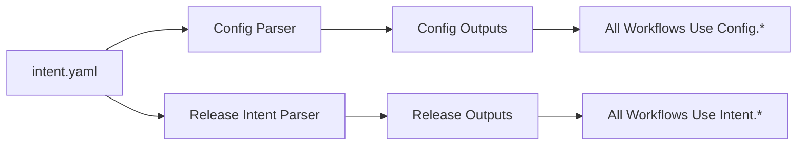
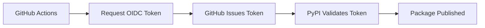

# Release Intent Configuration

Complete guide to configuring releases using the `intent.yaml` file.

## Overview

The `.github/tag_and_release/intent.yaml` file is the **central configuration hub** for both release behavior and comprehensive project settings. This intent-driven system provides a single source of truth for all release and project configuration.

## File Location

```
.github/tag_and_release/intent.yaml
```

## Configuration Architecture



### Two-Step Parsing Process

1. **Configuration Parsing** (`rw_parse_project_config.yaml`):
   - Loads and validates the complete `intent.yaml` structure
   - Provides structured outputs for project, git, docker, validation, and docs settings
   - Applies smart defaults for missing configuration sections
   - Auto-detects project and package names

2. **Release Intent Analysis** (`rw_parse_release_intent.yaml`):
   - Focuses on release-specific logic (release, level, artifacts, notes)
   - Compatible with both legacy and enhanced configuration formats
   - Uses configuration parser outputs for enhanced validation

## Complete Configuration Schema

```yaml
# === RELEASE INTENT CONFIGURATION ===
# Master release control
release: true                    # boolean - Enable/disable releases entirely

# Version bump configuration  
level: "auto"                    # string - Version bump level

# Artifact publishing configuration
artifacts:
  python: "auto"                 # string - Python package publishing
  docker: "auto"                 # string - Docker image publishing
  docs:                          # object | string - Documentation versioning
    mode: "auto"                 # string - Docs versioning mode
    sections: ["docs", "dev"]    # array - Docusaurus sections to version
    strategy: "changed"          # string - Versioning strategy

# Release notes
notes: "Release description"     # string - GitHub release notes

# === ENHANCED PROJECT CONFIGURATION ===
# Project identification and settings
project:
  name: null                     # string | null - Project name (auto-detected)
  package_name: null            # string | null - Python package name (auto-detected)
  base_branch: "master"         # string - Default branch for operations

# Git configuration for automated commits
git:
  commit:
    name: "GitHub Actions Bot"   # string - Git commit author name
    email: "actions@github.com"  # string - Git commit author email

# Python package configuration
python:
  auth_method: "oidc"           # string - PyPI authentication method (oidc | token)

# Docker configuration for container operations
docker:
  registries:
    dockerhub: "docker.io"       # string - Docker Hub registry URL
    ghcr: "ghcr.io"             # string - GitHub Container Registry URL
  health_check:
    path: "/health"              # string - Health check endpoint path
    port: 8000                   # number - Health check port
  run_options: "-e VAR=value"   # string - Docker run options

# Validation and staging configuration
validation:
  version: "1.0.0-validation"    # string - Version for validation workflows
  test_version: "validation-test" # string - Test version identifier

# Documentation configuration
docs:
  paths:
    readme: "README.md"          # string - README file path
    installation: "docs/INSTALLATION.md" # string - Installation guide path
    ci_cd: "docs/CI_CD.md"      # string - CI/CD documentation path
  preview:
    branch: "docs-preview"       # string - Documentation preview branch
```

## Release Intent Configuration

### 1. Master Release Control

**`release`** (boolean, default: `true`)

Controls whether releases are enabled.

```yaml
# Enable releases
release: true

# Disable releases entirely
release: false
```

**Behavior:**
- `true`: Enable release processing with all configured workflows
- `false`: Skip all release operations

### 2. Version Bump Level

**`level`** (string, default: `"auto"`)

Controls semantic version bumping.

```yaml
# Automatic version detection from commit messages
level: auto

# Force specific version bumps
level: patch  # 1.0.0 → 1.0.1
level: minor  # 1.0.0 → 1.1.0
level: major  # 1.0.0 → 2.0.0
```

**Options:**
- `"auto"`: Determine version bump automatically based on commit messages
- `"patch"`: Force patch version bump (bug fixes)
- `"minor"`: Force minor version bump (new features)
- `"major"`: Force major version bump (breaking changes)

### 3. Python Package Configuration

**`artifacts.python`** (string, default: `"auto"`)

Controls Python package publishing to PyPI.

```yaml
artifacts:
  # Conditional publishing (recommended)
  python: auto
  
  # Always publish
  python: force
  
  # Skip publishing
  python: skip
```

**Options:**
- `"auto"`: Publish if package files changed
- `"force"`: Always publish regardless of changes
- `"skip"`: Skip Python package publishing

#### PyPI Authentication Methods


**Configuration:**
```yaml
python:
  auth_method: "oidc"  # or "token"
```

#### OIDC Authentication (Recommended)

**Benefits:**
- ✅ Keyless authentication
- ✅ No API tokens to manage
- ✅ Enhanced security
- ✅ Zero secrets required

**Setup:**
1. Configure PyPI Trusted Publisher
2. Set `auth_method: oidc` in `intent.yaml`
3. No additional secrets needed

**How OIDC Works:**


#### Token Authentication (Legacy)

**Benefits:**
- ✅ Backward compatible
- ✅ Universal support
- ✅ Simple migration

**Setup:**
1. Generate PyPI API tokens
2. Add `PYPI_API_TOKEN` and `TEST_PYPI_API_TOKEN` secrets
3. Set `auth_method: token` in `intent.yaml`

**Comparison:**

| Feature | OIDC | Token |
|---------|------|-------|
| Security | 🟢 Keyless | 🟡 Requires rotation |
| Setup | 🟢 Simple | 🟡 Moderate |
| Maintenance | 🟢 Zero | 🟡 Regular rotation |
| Secrets | 🟢 None | 🔴 2 required |

### 4. Docker Image Configuration

**`artifacts.docker`** (string, default: `"auto"`)

Controls Docker image publishing to both DockerHub and GHCR.

```yaml
artifacts:
  # Conditional publishing (recommended)
  docker: auto
  
  # Always publish
  docker: force
  
  # Skip publishing
  docker: skip
```

**Options:**
- `"auto"`: Publish if Docker-related files changed
- `"force"`: Always publish to both registries
- `"skip"`: Skip Docker image publishing

:::tip Automatic Dockerfile Detection
Even with `docker: force`, the workflow gracefully skips Docker processes if no Dockerfile is found in the repository root. This ensures the same workflows work for both Docker-based and Python-only projects.
:::

**Dual Registry Publishing:**

When enabled, Docker images are published to both:
1. **DockerHub** (`docker.io`)
2. **GHCR** (`ghcr.io`)

Both registries receive identical images with the same version tags.

### 5. Documentation Configuration

**`artifacts.docs`** (object | string)

Controls documentation versioning with support for both legacy and enhanced formats.

#### Legacy Format (String)

```yaml
artifacts:
  docs: "auto"  # auto, force, skip
```

#### Enhanced Format (Object)

```yaml
artifacts:
  docs:
    mode: "auto"              # auto, force, skip
    sections: ["docs", "dev"]  # array of section names
    strategy: "changed"       # changed, always
```

**Configuration Options:**

**`docs.mode`** (string, default: `"auto"`)
- `"auto"`: Version docs based on strategy and change detection
- `"force"`: Always version docs regardless of changes
- `"skip"`: Skip documentation versioning

**`docs.sections`** (array, default: `["docs", "dev"]`)
- `"docs"`: Main user documentation
- `"dev"`: Development/contributor documentation
- `"api"`: API reference documentation

**`docs.strategy`** (string, default: `"changed"`)
- `"changed"`: Only version sections with file changes
- `"always"`: Version all configured sections

### 6. Release Notes

**`notes`** (string, default: `""`)

GitHub release notes content.

```yaml
# Simple notes
notes: "Bug fixes and improvements"

# Multi-line notes
notes: |
  ## What's New
  - Feature A
  - Feature B
  
  ## Bug Fixes
  - Fixed issue X
```

## Project Configuration

### 1. Project Settings

**`project`** (object)

Project identification and base settings.

```yaml
project:
  name: null                    # Auto-detected from repository
  package_name: null           # Auto-detected from pyproject.toml
  base_branch: "master"        # Default branch
```

**Fields:**
- **`name`**: Project name (auto-detected from repository)
- **`package_name`**: Python package name (extracted from `pyproject.toml`)
- **`base_branch`**: Default branch for operations

### 2. Git Configuration

**`git`** (object)

Git commit settings for automated operations.

```yaml
git:
  commit:
    name: "GitHub Actions Bot"
    email: "actions@github.com"
```

**Fields:**
- **`commit.name`**: Author name for automated commits
- **`commit.email`**: Author email for automated commits

**Usage:**
```yaml
# Version bump commits use these settings
- name: Configure Git
  run: |
    git config user.name "${{ needs.config.outputs.git_commit_name }}"
    git config user.email "${{ needs.config.outputs.git_commit_email }}"
```

### 3. Docker Configuration

**`docker`** (object)

Comprehensive Docker deployment configuration.

```yaml
docker:
  registries:
    dockerhub: "docker.io"
    ghcr: "ghcr.io"
  health_check:
    path: "/health"
    port: 8000
  run_options: "-e API_TOKEN=test_token -e DEBUG=true"
```

**Fields:**
- **`registries.dockerhub`**: Docker Hub registry URL
- **`registries.ghcr`**: GitHub Container Registry URL
- **`health_check.path`**: Health check endpoint path
- **`health_check.port`**: Health check port
- **`run_options`**: Flexible Docker run options string

**Advanced Docker Run Options:**

```yaml
# Basic environment variables
docker:
  run_options: "-e API_TOKEN=test_token -e DEBUG=true"

# With volumes
docker:
  run_options: "-e API_TOKEN=test -v /host/data:/app/data -v /host/logs:/app/logs"

# Complex configuration
docker:
  run_options: "-e API_TOKEN=test --network mynetwork --memory=512m --cpus=0.5"

# Production-ready
docker:
  run_options: "-e NODE_ENV=production -e API_TOKEN=prod --network prod-network --restart unless-stopped -v /data:/app/data"
```

**Benefits:**
- Multiple environment variables in one string
- Volume mounts for data persistence
- Network configuration
- Resource limits
- Runtime options

### 4. Validation Configuration

**`validation`** (object)

Settings for validation and staging workflows.

```yaml
validation:
  version: "1.0.0-validation"
  test_version: "validation-test"
```

**Fields:**
- **`version`**: Version identifier for validation workflows
- **`test_version`**: Test version identifier for staging

**Usage:**
```yaml
# TestPyPI deployment uses validation version
VERSION: ${{ needs.config.outputs.validation_version }}
```

### 5. Documentation Configuration

**`docs`** (object)

Documentation paths and preview settings.

```yaml
docs:
  paths:
    readme: "README.md"
    installation: "docs/INSTALLATION.md"
    ci_cd: "docs/CI_CD.md"
  preview:
    branch: "docs-preview"
```

**Fields:**
- **`paths.readme`**: README file path
- **`paths.installation`**: Installation guide path
- **`paths.ci_cd`**: CI/CD documentation path
- **`preview.branch`**: Preview branch name

## Configuration Examples

### Example 1: Conservative Release (Recommended)

```yaml
# Only release what has actually changed
release: true
level: auto
artifacts:
  python: auto
  docker: auto
  docs:
    mode: auto
    sections: ["docs", "dev"]
    strategy: changed
notes: "Automatic release with change detection"
```

### Example 2: Force Full Release

```yaml
# Force release all artifacts
release: true
level: patch
artifacts:
  python: force
  docker: force
  docs:
    mode: force
    sections: ["docs", "dev", "api"]
    strategy: always
notes: "Full release of all components"
```

### Example 3: Python-Only Release

```yaml
# Only release Python package
release: true
level: minor
artifacts:
  python: force
  docker: skip
  docs: skip
notes: "Python package only release"
```

### Example 4: Documentation-Only Release

```yaml
# Only version documentation
release: true
level: patch
artifacts:
  python: skip
  docker: skip
  docs:
    mode: force
    sections: ["docs", "dev"]
    strategy: always
notes: "Documentation update release"
```

### Example 5: Complete Configuration

```yaml
# === RELEASE INTENT ===
release: true
level: auto
artifacts:
  python: auto
  docker: auto
  docs:
    mode: auto
    sections: ["docs", "dev"]
    strategy: changed
notes: |
  ## What's New
  - Feature X
  
  ## Bug Fixes
  - Fixed issue Y

# === PROJECT CONFIGURATION ===
project:
  name: null
  package_name: null
  base_branch: "master"

git:
  commit:
    name: "GitHub Actions Bot"
    email: "actions@github.com"

python:
  auth_method: "oidc"

docker:
  registries:
    dockerhub: "docker.io"
    ghcr: "ghcr.io"
  health_check:
    path: "/health"
    port: 8000
  run_options: "-e API_TOKEN=test_token -e DEBUG=true"

validation:
  version: "1.0.0-validation"
  test_version: "validation-test"

docs:
  paths:
    readme: "README.md"
    installation: "docs/INSTALLATION.md"
    ci_cd: "docs/CI_CD.md"
  preview:
    branch: "docs-preview"
```

## Behavioral Matrix

### Docker Configuration Behavior

| Dockerfile Exists | Config: `docker: auto` | Config: `docker: force` | Config: `docker: skip` |
|-------------------|------------------------|-------------------------|------------------------|
| ✅ Yes            | Publishes if changed   | Always publishes        | Always skips           |
| ❌ No             | Skips (no Dockerfile)  | Skips (no Dockerfile)   | Always skips           |

### Python and Documentation Behavior

| Configuration | Changed Files | Behavior |
|---------------|---------------|----------|
| `python: auto` | Python files changed | ✅ Publishes to PyPI |
| `python: auto` | No Python files changed | ⏭️ Skips publishing |
| `python: force` | Any/no changes | ✅ Always publishes |
| `python: skip` | Any/no changes | ⏭️ Always skips |
| `docs.mode: auto, strategy: changed` | Docs files changed | ✅ Versions changed sections |
| `docs.mode: auto, strategy: always` | Any changes | ✅ Versions all sections |
| `docs.mode: force` | Any/no changes | ✅ Always versions |

## Configuration Validation

The release intent parser includes JSON schema validation:

- **Invalid Options**: Rejected with clear error messages
- **Type Checking**: Ensures correct data types
- **Required Fields**: Validates essential configuration
- **Default Values**: Applies sensible defaults

**Example Validation Errors:**

```yaml
# ❌ Invalid configuration
level: invalid_level        # Error: Must be auto, patch, minor, or major
artifacts:
  docs:
    strategy: invalid       # Error: Must be changed or always
    sections: "not-array"   # Error: Must be array of strings
```

## Best Practices

### 1. Use Conservative Configuration

Start with `auto` settings and change detection:

```yaml
artifacts:
  python: auto
  docker: auto
  docs:
    mode: auto
    strategy: changed
```

### 2. Enable OIDC Authentication

For PyPI, use OIDC instead of tokens:

```yaml
python:
  auth_method: "oidc"
```

### 3. Version Documentation Selectively

Only version changed sections:

```yaml
artifacts:
  docs:
    mode: auto
    sections: ["docs", "dev"]
    strategy: changed
```

### 4. Write Clear Release Notes

```yaml
notes: |
  ## What's New
  - Added feature X
  
  ## Bug Fixes
  - Fixed issue Y
  
  ## Breaking Changes
  - Changed API Z
```

### 5. Test Configuration Changes

Always validate configuration before production:

```bash
# Run validation workflow
gh workflow run release-validate.yml
```

## Troubleshooting

### Configuration Not Taking Effect

**Symptoms:**
- Workflows use default values despite custom config

**Solutions:**
1. Verify `intent.yaml` syntax
2. Check config parsing job logs
3. Ensure config job runs before dependent jobs
4. Review config output values

### Schema Validation Errors

**Symptoms:**
- Release intent parsing fails

**Solutions:**
1. Check configuration syntax against schema
2. Use JSON schema validator
3. Review error messages in logs
4. Verify data types match requirements

### Docker Jobs Skipped Unexpectedly

**Symptoms:**
- Docker jobs skip even with `docker: force`

**Solutions:**
1. Verify `Dockerfile` exists in repository root
2. Check "Dockerfile Check" step in logs
3. Ensure Dockerfile is committed to branch

## Testing Configuration

### Local Testing

```bash
# Run release intent script locally
uv run python scripts/ci/release_intent.py

# Validates schema and shows full parsed config
```

### Workflow Testing

```bash
# Test configuration parsing
gh workflow run release-validate.yml

# Check config outputs
gh run list --workflow=release-validate.yml --limit=1
gh run view <run-id> --log
```

### Debug Configuration

```yaml
# Add debug step to any workflow
- name: Debug Configuration
  env:
    CONFIG_OUTPUTS: ${{ toJson(needs.config.outputs) }}
  run: |
    echo "=== PARSED CONFIGURATION ==="
    echo "$CONFIG_OUTPUTS" | jq '.'
```

## Related Documentation

- [Production Release Workflow](./rw_release_complete.mdx) - Production deployment
- [Staging Release Workflow](./rw_release_staging_complete.mdx) - Staging deployment
- [Validation Release Workflow](./rw_release_validation_complete.mdx) - Pre-release validation
- [Configuration Reference](./configuration-reference.mdx) - Complete config reference
- [Release Management](./release-management.mdx) - Release process details
