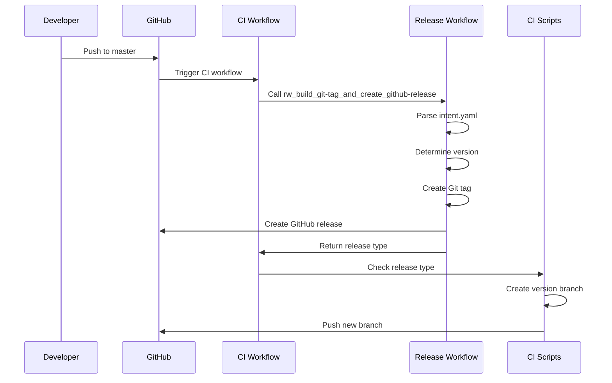

# Release Management

This document explains the automated release management system used in the GitHub Action Reusable Workflows project.

## Overview

The release management system automates the entire release process, from version detection to GitHub release creation and branch deployment.

## Release Workflow

### 1. Trigger Conditions

The release workflow is triggered when:
- Changes are pushed to the `master` branch
- Modified files include:
  - Release configuration (`.github/tag_and_release/**`)
  - Reusable workflows (`.github/workflows/rw_**.yaml`)
  - CI scripts (`scripts/ci/**.sh`)

### 2. Release Process Flow



## Release Configuration (`intent.yaml`)

### Basic Release Control

```yaml
# Enable or disable releases
release: true

# Version increment level
level: patch  # Options: auto | patch | minor | major
```

#### Level Options

| Level | Description | Example |
|-------|-------------|---------|
| `auto` | Automatically detect from commit messages | `1.0.0` → `1.0.1` or `1.1.0` |
| `patch` | Increment patch version | `1.0.0` → `1.0.1` |
| `minor` | Increment minor version | `1.0.0` → `1.1.0` |
| `major` | Increment major version | `1.0.0` → `2.0.0` |

### Release Notes

```yaml
notes: "Automatic release based on semantic versioning"
```

Release notes can be:
- A simple string (as shown above)
- Read from `release-notes.md` file
- Generated from commit messages

### Release Artifacts

```yaml
artifacts:
  python: auto   # Python package release
  docker: auto   # Docker image release
  docs:          # Documentation versioning
    mode: auto
    sections:
      - docs
      - dev
    strategy: always
```

#### Artifact Options

| Option | Description |
|--------|-------------|
| `auto` | Release if changes detected |
| `force` | Always release |
| `skip` | Never release |

## Release Types

The workflow produces different release types based on configuration:

### Official Release

**Characteristics:**
- Full semantic version (e.g., `v1.2.3`)
- Creates a version branch
- Triggers documentation deployment
- Suitable for production use

**Configuration:**
```yaml
release: true
level: patch  # or minor, major
```

### Pre-Release

**Characteristics:**
- Version with pre-release suffix (e.g., `v1.2.3-rc.1`)
- No version branch created
- Marked as pre-release on GitHub
- For testing and validation

**Configuration:**
```yaml
release: true
level: auto
# With pre-release commits or tags
```

### No Release

**Characteristics:**
- No tag or release created
- Workflow runs but skips release steps
- Useful for documentation-only changes

**Configuration:**
```yaml
release: false
```

## Version Detection

### Automatic Version Detection

When `level: auto`, the workflow analyzes:

1. **Commit Messages**
   - `BREAKING CHANGE:` or `!:` → Major version
   - `feat:` → Minor version
   - `fix:`, `docs:`, etc. → Patch version

2. **File Changes**
   - Changes to public APIs → Minor or Major
   - Bug fixes → Patch
   - Documentation only → No version change

3. **Previous Tags**
   - Reads the latest Git tag
   - Increments based on detected changes

### Manual Version Specification

Specify the exact version level:

```yaml
level: minor  # Forces minor version increment
```

## Git Tag Creation

### Tag Format

Tags follow semantic versioning:
```
v{major}.{minor}.{patch}[-{prerelease}]
```

Examples:
- `v1.0.0` - Official release
- `v1.2.3` - Patch release
- `v2.0.0-rc.1` - Release candidate
- `v1.5.0-beta.2` - Beta release

### Tag Metadata

Each tag includes:
- **Commit SHA** - The exact commit being tagged
- **Tagger** - GitHub Actions Bot
- **Date** - Timestamp of tag creation
- **Message** - Release notes or auto-generated message

## GitHub Release Creation

### Release Components

1. **Title**
   - Format: `Release v{version}`
   - Can be customized in `release-title.md`

2. **Body**
   - Release notes from `intent.yaml` or `release-notes.md`
   - Auto-generated changelog
   - Links to documentation

3. **Assets**
   - Workflow files (if applicable)
   - Documentation archives
   - Additional artifacts

### Release Metadata

```yaml
Release:
  tag_name: v1.2.3
  name: Release v1.2.3
  draft: false
  prerelease: false  # or true for pre-releases
  generate_release_notes: true
```

## Branch Deployment

### Version Branch Creation

After an official release, a version branch is created:

**Branch Name:** `v{major}.{minor}.{patch}`

**Purpose:**
- Provides stable workflow references
- Enables version pinning in consuming projects
- Maintains backward compatibility

### Branch Creation Process

1. **Check Release Type**
   ```bash
   if [[ "$RELEASE_TYPE" != "Pre-Release" ]]; then
     # Create branch
   fi
   ```

2. **Create Branch from Tag**
   ```bash
   git checkout -b v1.2.3 v1.2.3
   git push origin v1.2.3
   ```

3. **Verify Branch**
   - Ensure branch exists on remote
   - Verify workflow files are accessible

### Using Version Branches

Consumers can reference specific versions:

```yaml
jobs:
  test:
    uses: owner/repo/.github/workflows/rw_run_test.yaml@v1.2.3
```

## Release Automation Scripts

### Key Scripts

#### `check_getting_output.sh`

Verifies that release information was properly passed between jobs:

```bash
#!/bin/bash
# Checks if RELEASE_TYPE environment variable is set
if [ -z "$RELEASE_TYPE" ]; then
  echo "Error: RELEASE_TYPE not set"
  exit 1
fi
echo "Release type: $RELEASE_TYPE"
```

#### `deployment_new_version_workflow.sh`

Creates and pushes the version branch:

```bash
#!/bin/bash
DEBUG_MODE=${1:-false}

# Get release version from environment
VERSION=$RELEASE_TYPE

# Create branch from current commit
git checkout -b "$VERSION"

# Push to remote
git push origin "$VERSION"

if [ "$DEBUG_MODE" = "true" ]; then
  echo "Created and pushed branch: $VERSION"
fi
```

## Release Workflow Outputs

The release workflow provides outputs for subsequent jobs:

| Output | Description | Example |
|--------|-------------|---------|
| `github-action_reusable_workflow_release_version` | Release version or type | `v1.2.3` or `Pre-Release` |
| `release_created` | Whether a release was created | `true` or `false` |
| `tag_name` | Git tag name | `v1.2.3` |

### Using Outputs

```yaml
jobs:
  release:
    uses: ./.github/workflows/rw_build_git-tag_and_create_github-release.yaml
    # ... configuration

  deploy:
    needs: release
    if: ${{ needs.release.outputs.github-action_reusable_workflow_release_version != 'Pre-Release' }}
    runs-on: ubuntu-latest
    steps:
      - name: Use release version
        run: echo "Version: ${{ needs.release.outputs.tag_name }}"
```

## Best Practices

### 1. Semantic Versioning

Follow semantic versioning principles:
- **Major** - Breaking changes
- **Minor** - New features (backward compatible)
- **Patch** - Bug fixes

### 2. Release Notes

Write clear, informative release notes:
```yaml
notes: |
  ## What's New
  - Added new workflow for Docker operations
  - Improved error handling in test workflows
  
  ## Bug Fixes
  - Fixed coverage report organization
  - Resolved Python version detection issues
  
  ## Breaking Changes
  - Renamed workflow input parameters
```

### 3. Testing Before Release

- Test workflows in a development branch
- Verify all reusable workflows work correctly
- Check documentation builds successfully

### 4. Version Branch Management

- Don't modify version branches after creation
- Use version branches for stable references
- Keep master as the development branch

## Troubleshooting

### Release Not Created

**Symptoms:**
- Workflow runs but no tag/release appears
- No error messages in logs

**Solutions:**
1. Check `intent.yaml` has `release: true`
2. Verify file changes match trigger paths
3. Review workflow permissions
4. Check for existing tags with same version

### Wrong Version Number

**Symptoms:**
- Version doesn't match expectations
- Skipped version numbers

**Solutions:**
1. Verify `level` setting in `intent.yaml`
2. Check commit message format
3. Review previous tags
4. Use explicit version level instead of `auto`

### Branch Not Created

**Symptoms:**
- Release created but no version branch
- Branch deployment job skipped

**Solutions:**
1. Check if release is marked as pre-release
2. Verify `RELEASE_TYPE` output
3. Review script permissions
4. Check GitHub token permissions

### Permission Errors

**Symptoms:**
- "Permission denied" errors
- Failed to push tags/branches

**Solutions:**
1. Verify workflow has `contents: write` permission
2. Check GitHub token is valid
3. Review repository settings
4. Ensure branch protection rules allow pushes

## Related Documentation

- [CI/CD Overview](./cicd-overview.mdx) - Complete CI/CD architecture
- [Configuration Reference](./configuration-reference.mdx) - intent.yaml details
- [Documentation Pipeline](./documentation-pipeline.mdx) - Documentation workflow details
- [Workflows Overview](./index.mdx) - All reusable workflows
