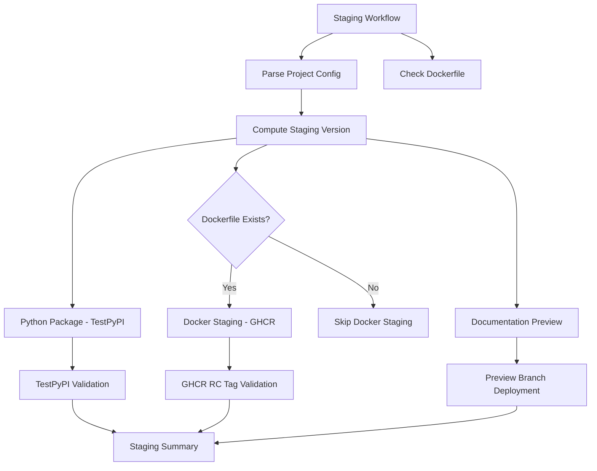

# rw_release_staging_complete.yaml

Staging release workflow that deploys to test environments for safe pre-production testing.

[](https://github.com/Chisanan232/GitHub-Action_Reusable_Workflows-Python/blob/master/.github/workflows/rw_release_staging_complete.yaml)

## Description

This workflow deploys release candidates to staging environments including TestPyPI, GHCR staging tags, and documentation preview branches. It provides a safe testing environment before production deployment.

## Purpose

- **Safe Testing**: Test releases in staging environment before production
- **TestPyPI Deployment**: Publish to TestPyPI for package testing
- **Staging Docker Images**: Deploy RC images to GHCR with staging tags
- **Documentation Preview**: Deploy documentation to preview branch
- **Configuration Testing**: Validate config-based settings in staging
- **Integration Testing**: Test complete release flow end-to-end

## Inputs

| Parameter | Type | Required | Default | Description |
|-----------|------|----------|---------|-------------|
| `level` | string | No | `auto` | Release level (`auto`, `patch`, `minor`, `major`) |
| `python` | string | No | `auto` | Python package staging (`auto`, `force`, `skip`) |
| `docker` | string | No | `auto` | Docker image staging (`auto`, `force`, `skip`) |
| `docs` | string | No | `auto` | Documentation staging (`auto`, `force`, `skip`) |
| `rc_number` | number | No | `0` | Release candidate number (e.g., 0 for `-rc.0`) |

## Outputs

| Output | Description |
|--------|-------------|
| `staging_version` | Staging version number (e.g., `1.0.0-rc.0`) |
| `testpypi_published` | Whether package was published to TestPyPI |
| `docker_staged` | Whether Docker images were staged |
| `docs_previewed` | Whether documentation was deployed to preview |

## Workflow Architecture



## Staging Targets

### 1. TestPyPI (Python Package Staging)

**Purpose:** Test Python package installation before PyPI release

**Registry:** `https://test.pypi.org`

**Version Format:** Uses validation version from config (e.g., `1.0.0-validation`)

**Installation Test:**
```bash
pip install -i https://test.pypi.org/simple/ your-package-name
```

**Configuration:**
```yaml
# Uses config-based validation version
VALIDATION_VERSION: ${{ needs.config.outputs.validation_version }}

# Git commits with config-based settings
GIT_COMMIT_NAME: ${{ needs.config.outputs.git_commit_name }}
GIT_COMMIT_EMAIL: ${{ needs.config.outputs.git_commit_email }}
```

**Features:**
- Tests package build and upload process
- Validates package metadata
- Tests installation from TestPyPI
- Uses config-based git settings for commits

### 2. GHCR Staging (Docker Image Staging)

**Only runs if Dockerfile exists**

**Purpose:** Test Docker images with release candidate tags

**Registry:** `ghcr.io` (GitHub Container Registry)

**Tag Format:** `{version}-rc.{number}` (e.g., `1.0.0-rc.0`)

**Pull Command:**
```bash
docker pull ghcr.io/owner/repo:1.0.0-rc.0
```

**Configuration:**
```yaml
# Uses config-based registry URL
GHCR_REGISTRY: ${{ needs.config.outputs.docker_registry_ghcr }}

# Health check with config-based settings
HEALTH_CHECK_PATH: ${{ needs.config.outputs.docker_health_check_path }}
HEALTH_CHECK_PORT: ${{ needs.config.outputs.docker_health_check_port }}

# Application environment from config
APP_ENV_NAME: ${{ needs.config.outputs.docker_app_env_name }}
APP_ENV_VALUE: ${{ needs.config.outputs.docker_app_env_value }}
```

**Features:**
- Multi-architecture builds (amd64, arm64)
- Health check validation
- Config-based registry and settings
- RC tagging for staging identification
- Automatically skipped when no Dockerfile present

### 3. Documentation Preview

**Purpose:** Preview documentation changes before production deployment

**Target:** Preview branch (configurable via config)

**Branch Format:** Uses `docs_preview_branch` from config (default: `docs-preview`)

**Configuration:**
```yaml
# Uses config-based preview branch
PREVIEW_BRANCH: ${{ needs.config.outputs.docs_preview_branch }}

# Documentation paths from config
README_PATH: ${{ needs.config.outputs.docs_readme_path }}
INSTALLATION_PATH: ${{ needs.config.outputs.docs_installation_path }}
CICD_PATH: ${{ needs.config.outputs.docs_ci_cd_path }}

# Test version from config
TEST_VERSION: ${{ needs.config.outputs.validation_test_version }}
```

**Features:**
- Deploys to config-based preview branch
- Updates version references using config paths
- Tests documentation build process
- Validates multi-section versioning

## Staging Process Flow

### Step 1: Configuration Parsing

```yaml
config:
  name: Parse Configuration
  uses: ./.github/workflows/rw_parse_project_config.yaml
```

**Loads:**
- Validation version settings
- Preview branch configuration
- Docker registry URLs
- Git commit settings
- Documentation paths

### Step 2: Dockerfile Detection

```yaml
check-dockerfile:
  name: Check Dockerfile Exists
  runs-on: ubuntu-latest
  outputs:
    has_dockerfile: ${{ steps.check.outputs.has_dockerfile }}
```

**Checks:**
- Dockerfile presence in repository root
- Determines if Docker staging should run
- Provides clear skip messages

### Step 3: Staging Version Computation

**Version Format:**
- Base version from latest tag or config
- Appends release candidate suffix
- Example: `1.0.0-rc.0`, `1.2.3-rc.1`

**Uses Config:**
```yaml
validation_version: ${{ needs.config.outputs.validation_version }}
test_version: ${{ needs.config.outputs.validation_test_version }}
```

### Step 4: TestPyPI Deployment

```yaml
python-testpypi:
  uses: ./.github/workflows/rw_push_pypi.yaml
  with:
    repository: 'testpypi'
    version: ${{ needs.staging-version.outputs.version }}
```

**Process:**
1. Build package with staging version
2. Publish to TestPyPI
3. Validate package installation
4. Test import and basic functionality

### Step 5: GHCR Staging Deployment

**Only if Dockerfile exists**

```yaml
docker-ghcr-staging:
  if: needs.check-dockerfile.outputs.has_dockerfile == 'true'
  uses: ./.github/workflows/rw_docker_operations.yaml
  with:
    operation: 'push'
    registry: ${{ needs.config.outputs.docker_registry_ghcr }}
    version: ${{ needs.staging-version.outputs.version }}
    tag_suffix: '-rc'
```

**Process:**
1. Build Docker image with RC tag
2. Push to GHCR with staging tag
3. Run health check validation
4. Test container startup

### Step 6: Documentation Preview Deployment

```yaml
docs-preview:
  uses: ./.github/workflows/rw_docs_operations.yaml
  with:
    operation: 'deploy'
    branch: ${{ needs.config.outputs.docs_preview_branch }}
    version: ${{ needs.config.outputs.validation_test_version }}
```

**Process:**
1. Build documentation
2. Deploy to preview branch
3. Update version references
4. Test documentation links

## Usage Examples

### Basic Staging Release

```yaml
jobs:
  staging:
    uses: Chisanan232/GitHub-Action_Reusable_Workflows-Python/.github/workflows/rw_release_staging_complete.yaml@master
```

### Custom Staging Configuration

```yaml
jobs:
  staging:
    uses: Chisanan232/GitHub-Action_Reusable_Workflows-Python/.github/workflows/rw_release_staging_complete.yaml@master
    with:
      level: 'minor'
      python: 'force'
      docker: 'auto'
      docs: 'force'
      rc_number: 1  # Creates 1.0.0-rc.1
```

### Manual Staging Trigger

```yaml
name: Staging Release

on:
  workflow_dispatch:
    inputs:
      rc_number:
        description: 'Release candidate number'
        required: false
        default: '0'
        type: string

jobs:
  staging:
    uses: Chisanan232/GitHub-Action_Reusable_Workflows-Python/.github/workflows/rw_release_staging_complete.yaml@master
    with:
      rc_number: ${{ inputs.rc_number }}
```

## Config-Enhanced Features

### 1. Validation Version Settings

From `intent.yaml`:
```yaml
validation:
  version: "1.0.0-validation"
  test_version: "validation-test"
```

Used in staging:
- TestPyPI package version
- Documentation test version
- Git tag for staging release

### 2. Preview Branch Configuration

From `intent.yaml`:
```yaml
docs:
  preview:
    branch: "docs-preview"
```

Used for:
- Documentation preview deployment
- Staging documentation branch
- Version testing environment

### 3. Docker Registry Configuration

From `intent.yaml`:
```yaml
docker:
  registries:
    ghcr: "ghcr.io"
  health_check:
    path: "/health"
    port: 8000
```

Used for:
- GHCR staging deployment
- Health check validation
- Container testing

### 4. Git Configuration

From `intent.yaml`:
```yaml
git:
  commit:
    name: "GitHub Actions Bot"
    email: "actions@github.com"
```

Used for:
- Version bump commits
- Documentation updates
- Staging branch operations

## Staging Validation

### TestPyPI Validation

**Tests:**
```bash
# Install from TestPyPI
pip install -i https://test.pypi.org/simple/ package-name

# Test import
python -c "import package_name; print(package_name.__version__)"

# Run basic tests
pytest tests/smoke/
```

### Docker Staging Validation

**Only runs if Dockerfile exists**

**Tests:**
```bash
# Pull staging image
docker pull ghcr.io/owner/repo:1.0.0-rc.0

# Run container
docker run -d --name test ghcr.io/owner/repo:1.0.0-rc.0

# Health check
curl -f http://localhost:8000/health

# Stop container
docker stop test
```

### Documentation Preview Validation

**Tests:**
- Documentation builds successfully
- All links work correctly
- Version references are updated
- Preview branch is accessible

## Automatic Dockerfile Detection

The staging workflow automatically handles Dockerfile presence:

- ✅ **Dockerfile exists**: Docker staging runs with GHCR
- ⚠️ **No Dockerfile**: Docker staging is skipped
- 📋 **Clear logging**: Workflow indicates Docker was skipped

**Example Output (No Dockerfile):**
```
=== Staging Summary ===
✅ TestPyPI: Published (1.0.0-validation)
⏭️ Docker Staging: Skipped (no Dockerfile)
✅ Documentation Preview: Deployed (docs-preview branch)

Staging Version: 1.0.0-rc.0
```

## Best Practices

### 1. Test Before Production

Always run staging before production releases:
```bash
# Run staging first
gh workflow run release-staging.yml

# Validate staging artifacts
# Then run production release
gh workflow run release.yml
```

### 2. Validate Staging Artifacts

**TestPyPI:**
```bash
# Install and test
pip install -i https://test.pypi.org/simple/ your-package
python -c "import your_package; your_package.test()"
```

**Docker Staging:**
```bash
# Pull and test (if Dockerfile exists)
docker pull ghcr.io/owner/repo:1.0.0-rc.0
docker run ghcr.io/owner/repo:1.0.0-rc.0 --version
```

**Documentation Preview:**
- Review preview branch documentation
- Check version references
- Validate all links work

### 3. Use RC Numbers

Increment RC numbers for multiple staging attempts:
```yaml
with:
  rc_number: 0  # First attempt: 1.0.0-rc.0
  rc_number: 1  # Second attempt: 1.0.0-rc.1
```

### 4. Monitor Staging Results

Review staging workflow logs and artifacts before production deployment.

### 5. Clean Up Staging Artifacts

Periodically clean up old staging artifacts:
- Remove old RC tags from GHCR
- Clean up preview branches
- Archive old TestPyPI versions

## Troubleshooting

### TestPyPI Upload Failed

**Symptoms:**
- Upload fails with authentication error
- Version conflict errors

**Solutions:**
1. Verify `TEST_PYPI_API_TOKEN` secret exists
2. Check version doesn't already exist on TestPyPI
3. Review TestPyPI upload logs

### Docker Staging Failed

**Symptoms:**
- Docker build fails in staging
- Health check fails

**Solutions:**
1. Verify Dockerfile exists (check Dockerfile detection logs)
2. Check GHCR authentication
3. Review Docker build logs
4. Test health check endpoint locally

### Documentation Preview Failed

**Symptoms:**
- Preview deployment fails
- Branch creation errors

**Solutions:**
1. Verify preview branch configuration
2. Check documentation build logs
3. Validate MDX file syntax
4. Review branch permissions

### Configuration Not Applied

**Symptoms:**
- Staging uses default values
- Config settings ignored

**Solutions:**
1. Verify `intent.yaml` syntax
2. Check config parsing job logs
3. Ensure config job runs before staging jobs
4. Review config output values

## Related Documentation

- [Production Release Workflow](rw_release_complete.mdx) - Production deployment
- [Validation Release Workflow](rw_release_validation_complete.mdx) - Pre-release validation
- [Release Intent Configuration](release-intent-configuration.mdx) - intent.yaml configuration guide
