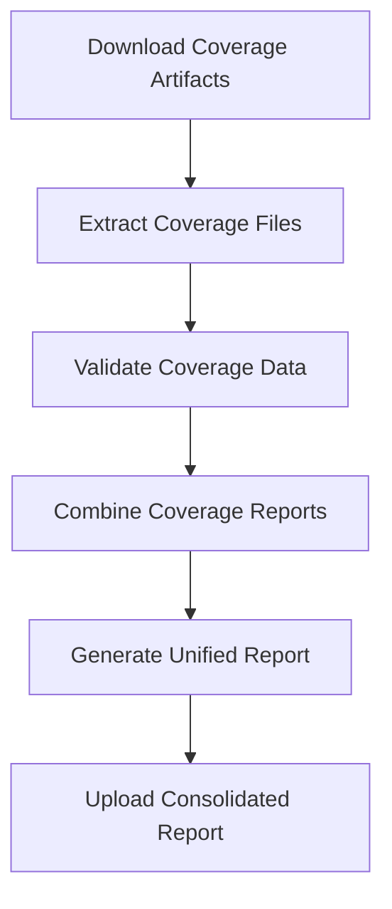

# Organize Coverage Reports Workflow

[](https://github.com/Chisanan232/GitHub-Action_Reusable_Workflows-Python/blob/master/.github/workflows/rw_organize_test_cov_reports.yaml)

Organize and consolidate test coverage reports from multiple test runs.

## Overview

This workflow collects, organizes, and consolidates coverage reports from multiple test executions (e.g., unit tests, integration tests, different Python versions) into a unified coverage report.

## When to Use

- ✅ You run multiple test suites (unit, integration, e2e)
- ✅ You test across multiple Python versions
- ✅ You need consolidated coverage metrics
- ✅ You want to combine coverage from parallel test runs

## Workflow Architecture



## Inputs

### Required Inputs

| Input | Type | Description |
|-------|------|-------------|
| `test_type` | string | Type of tests (for artifact naming) |

### Optional Inputs

| Input | Type | Default | Description |
|-------|------|---------|-------------|
| `coverage_format` | string | `'xml'` | Output format (xml, html, json, lcov) |
| `artifact_pattern` | string | `'coverage-*'` | Pattern to match coverage artifacts |
| `combine_strategy` | string | `'merge'` | How to combine (merge, append) |

## Outputs

| Output | Description |
|--------|-------------|
| `coverage_report_path` | Path to consolidated coverage report |
| `coverage_percentage` | Overall coverage percentage |
| `report_artifact_name` | Name of uploaded artifact |

## Usage Examples

### Basic Usage

```yaml
name: CI

on: [push, pull_request]

jobs:
  unit-tests:
    uses: Chisanan232/GitHub-Action_Reusable_Workflows-Python/.github/workflows/rw_run_test.yaml@master
    with:
      python_version: '3.11'
      test_type: unit-test
      all_test_items_paths: test/unit_test/

  integration-tests:
    uses: Chisanan232/GitHub-Action_Reusable_Workflows-Python/.github/workflows/rw_run_test.yaml@master
    with:
      python_version: '3.11'
      test_type: integration-test
      all_test_items_paths: test/integration_test/

  organize-coverage:
    needs: [unit-tests, integration-tests]
    uses: Chisanan232/GitHub-Action_Reusable_Workflows-Python/.github/workflows/rw_organize_test_cov_reports.yaml@master
    with:
      test_type: all-tests
```

### Multi-Version Coverage

```yaml
jobs:
  multi-version-tests:
    uses: Chisanan232/GitHub-Action_Reusable_Workflows-Python/.github/workflows/rw_run_test_with_multi_py_versions.yaml@master
    with:
      test_type: unit-test
      all_test_items_paths: test/unit_test/
      python_versions: '["3.10", "3.11", "3.12"]'

  organize-coverage:
    needs: multi-version-tests
    uses: Chisanan232/GitHub-Action_Reusable_Workflows-Python/.github/workflows/rw_organize_test_cov_reports.yaml@master
    with:
      test_type: unit-test
      coverage_format: xml
```

### Complete Pipeline with Upload

```yaml
jobs:
  unit-tests:
    uses: Chisanan232/GitHub-Action_Reusable_Workflows-Python/.github/workflows/rw_run_test.yaml@master
    with:
      python_version: '3.11'
      test_type: unit-test
      all_test_items_paths: test/unit_test/

  integration-tests:
    uses: Chisanan232/GitHub-Action_Reusable_Workflows-Python/.github/workflows/rw_run_test.yaml@master
    with:
      python_version: '3.11'
      test_type: integration-test
      all_test_items_paths: test/integration_test/

  organize-coverage:
    needs: [unit-tests, integration-tests]
    uses: Chisanan232/GitHub-Action_Reusable_Workflows-Python/.github/workflows/rw_organize_test_cov_reports.yaml@master
    with:
      test_type: all-tests
      coverage_format: xml

  upload-coverage:
    needs: organize-coverage
    uses: Chisanan232/GitHub-Action_Reusable_Workflows-Python/.github/workflows/rw_upload_test_cov_report.yaml@master
    secrets:
      codecov_token: ${{ secrets.CODECOV_TOKEN }}
    with:
      test_type: all-tests
      upload-to-codecov: true
```

## How It Works

### Step 1: Download Coverage Artifacts

Downloads all coverage artifacts from previous jobs:

```yaml
- uses: actions/download-artifact@v4
  with:
    pattern: ${{ inputs.artifact_pattern }}
    path: coverage-reports/
```

### Step 2: Validate Coverage Data

Checks that coverage files are valid:

```bash
for file in coverage-reports/**/*.xml; do
  if ! xmllint --noout "$file"; then
    echo "Invalid coverage file: $file"
    exit 1
  fi
done
```

### Step 3: Combine Coverage Reports

Merges all coverage data:

```bash
coverage combine coverage-reports/**/.coverage*
coverage xml -o coverage-combined.xml
```

### Step 4: Generate Report

Creates the final consolidated report:

```bash
coverage report --precision=2
coverage html -d htmlcov/
```

### Step 5: Upload Artifact

Uploads the consolidated report:

```yaml
- uses: actions/upload-artifact@v4
  with:
    name: coverage-combined-${{ inputs.test_type }}
    path: coverage-combined.xml
```

## Coverage Formats

### XML Format (Default)

Best for uploading to coverage services:

```yaml
coverage_format: xml
```

Output: `coverage.xml` (Cobertura format)

### HTML Format

Best for human-readable reports:

```yaml
coverage_format: html
```

Output: `htmlcov/` directory with interactive HTML

### JSON Format

Best for programmatic processing:

```yaml
coverage_format: json
```

Output: `coverage.json` with detailed metrics

### LCOV Format

Best for some CI tools:

```yaml
coverage_format: lcov
```

Output: `coverage.lcov`

## Combine Strategies

### Merge Strategy (Default)

Combines coverage data intelligently:

```yaml
combine_strategy: merge
```

- Merges line coverage
- Combines branch coverage
- Handles overlapping files correctly

### Append Strategy

Appends coverage data sequentially:

```yaml
combine_strategy: append
```

- Faster processing
- Simpler logic
- May have duplicates

## Best Practices

### 1. Consistent Coverage Configuration

Use the same `.coveragerc` or `pyproject.toml` configuration across all test runs:

```toml
[tool.coverage.run]
source = ["src"]
parallel = true
data_file = ".coverage"

[tool.coverage.report]
precision = 2
show_missing = true
```

### 2. Artifact Naming Convention

Use consistent artifact naming:

```yaml
# In test workflows
- uses: actions/upload-artifact@v4
  with:
    name: coverage-${{ matrix.python-version }}-${{ inputs.test_type }}
    path: .coverage
```

### 3. Coverage Paths

Ensure consistent source paths:

```toml
[tool.coverage.paths]
source = [
    "src/",
    "*/site-packages/",
]
```

### 4. Parallel Coverage

Enable parallel mode for concurrent tests:

```toml
[tool.coverage.run]
parallel = true
```

## Troubleshooting

### Missing Coverage Data

**Symptoms:**
- No coverage files found
- Empty coverage report

**Solutions:**
1. Verify artifact names match pattern:
   ```yaml
   artifact_pattern: 'coverage-*'
   ```

2. Check test workflows upload coverage:
   ```yaml
   - uses: actions/upload-artifact@v4
     with:
       name: coverage-unit-test
       path: .coverage
   ```

3. Ensure coverage is generated during tests

### Coverage Combination Fails

**Symptoms:**
- "No data to combine" error
- Coverage.py errors

**Solutions:**
1. Check coverage file format:
   ```bash
   coverage debug data
   ```

2. Verify source paths are consistent:
   ```toml
   [tool.coverage.paths]
   source = ["src/"]
   ```

3. Use parallel mode:
   ```toml
   [tool.coverage.run]
   parallel = true
   ```

### Incorrect Coverage Percentage

**Symptoms:**
- Coverage percentage doesn't match expectations
- Missing files in report

**Solutions:**
1. Check source configuration:
   ```toml
   [tool.coverage.run]
   source = ["src"]
   omit = ["*/tests/*"]
   ```

2. Verify all test runs completed successfully

3. Review coverage paths configuration

## Coverage Report Analysis

### Reading the Report

The consolidated report shows:

```
Name                      Stmts   Miss  Cover
---------------------------------------------
src/__init__.py              10      0   100%
src/module.py               150     15    90%
src/utils.py                 50      5    90%
---------------------------------------------
TOTAL                       210     20    90%
```

### Key Metrics

- **Stmts**: Total statements
- **Miss**: Missed statements
- **Cover**: Coverage percentage
- **Missing**: Line numbers not covered

### Coverage Thresholds

Set minimum coverage requirements:

```toml
[tool.coverage.report]
fail_under = 80
precision = 2
```

## Related Workflows

- [rw_run_test](./rw_run_test.mdx) - Run tests
- [rw_run_test_with_multi_py_versions](./rw_run_test_with_multi_py_versions.mdx) - Multi-version tests
- [rw_upload_test_cov_report](./rw_upload_test_cov_report.mdx) - Upload coverage
- [rw_get_tests](./rw_get_tests.mdx) - Discover tests

## Additional Resources

- [Coverage.py Documentation](https://coverage.readthedocs.io/)
- [Coverage.py Configuration](https://coverage.readthedocs.io/en/latest/config.html)
- [Combining Coverage Data](https://coverage.readthedocs.io/en/latest/cmd.html#combining-data-files)
