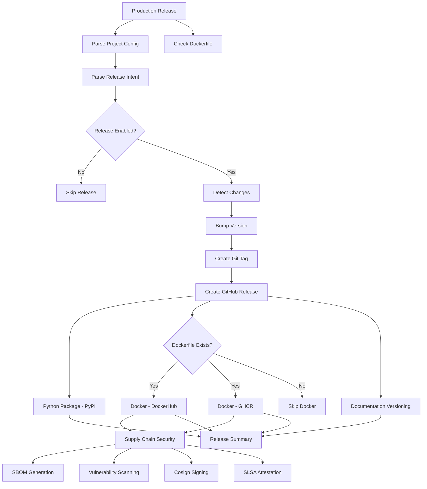

# rw_release_complete.yaml

Complete production release workflow that handles versioning, building, and deploying all release artifacts.

[](https://github.com/Chisanan232/GitHub-Action_Reusable_Workflows-Python/blob/master/.github/workflows/rw_release_complete.yaml)

## Description

This workflow orchestrates the complete production release process including version bumping, Python package publishing to PyPI, Docker image publishing to multiple registries, documentation versioning, and supply chain security.

## Purpose

- **Production Releases**: Deploy stable releases to production registries
- **Multi-Target Deployment**: Python (PyPI), Docker (DockerHub & GHCR), Documentation
- **Version Management**: Automatic semantic versioning and Git tagging
- **Supply Chain Security**: SBOM, vulnerability scanning, signing, and attestation
- **Documentation Versioning**: Multi-section Docusaurus versioning
- **GitHub Releases**: Automatic GitHub release creation with notes

## Inputs

| Parameter | Type | Required | Default | Description |
|-----------|------|----------|---------|-------------|
| `level` | string | No | `auto` | Release level (`auto`, `patch`, `minor`, `major`) |
| `python` | string | No | `auto` | Python package release (`auto`, `force`, `skip`) |
| `docker` | string | No | `auto` | Docker image release (`auto`, `force`, `skip`) |
| `docs` | string | No | `auto` | Documentation versioning (`auto`, `force`, `skip`) |
| `notes` | string | No | `''` | Release notes for GitHub release |

## Secrets

| Secret | Required | Description |
|--------|----------|-------------|
| `DOCKERHUB_USERNAME` | Conditional | DockerHub username (required if publishing to DockerHub) |
| `DOCKERHUB_TOKEN` | Conditional | DockerHub access token (required if publishing to DockerHub) |
| `PYPI_API_TOKEN` | Conditional | PyPI API token (required for token-based auth) |
| `TEST_PYPI_API_TOKEN` | Conditional | TestPyPI API token (required for token-based auth) |

## Outputs

| Output | Description |
|--------|-------------|
| `version` | Released version number |
| `release_performed` | Whether release was performed |
| `python_released` | Whether Python package was released |
| `docker_released` | Whether Docker images were released |
| `docs_released` | Whether documentation was versioned |

## Workflow Architecture



## Release Process Flow

### Step 1: Configuration Parsing

```yaml
config:
  name: Parse Configuration
  uses: ./.github/workflows/rw_parse_project_config.yaml
```

**Loads:**
- Project name and package name
- Git commit settings
- Docker registry URLs and health check configuration
- Documentation paths and preview branch
- Validation version settings

### Step 2: Dockerfile Detection

```yaml
check-dockerfile:
  name: Check Dockerfile Exists
  runs-on: ubuntu-latest
  outputs:
    has_dockerfile: ${{ steps.check.outputs.has_dockerfile }}
```

**Determines:**
- Whether Docker processes should run
- Enables conditional Docker job execution
- Provides clear logging for Docker availability

### Step 3: Release Intent Analysis

```yaml
intent:
  uses: ./.github/workflows/rw_parse_release_intent.yaml
  needs: config
  with:
    level: ${{ inputs.level }}
    python: ${{ inputs.python }}
    docker: ${{ inputs.docker }}
    docs: ${{ inputs.docs }}
    notes: ${{ inputs.notes }}
```

**Determines:**
- Whether to perform release
- Which artifacts to release
- Version bump level
- Release notes content

### Step 4: Change Detection

```yaml
detect_changes:
  name: Detect Changes
  runs-on: ubuntu-latest
  outputs:
    docs_changed: ${{ steps.changes.outputs.docs }}
    dev_changed: ${{ steps.changes.outputs.dev }}
```

**Detects:**
- Documentation section changes
- Development documentation changes
- Determines which docs sections to version

### Step 5: Version Bump

```yaml
bump_version:
  uses: ./.github/workflows/rw_version_bump.yaml
  with:
    level: ${{ needs.intent.outputs.level }}
```

**Process:**
1. Reads current version from Git tags
2. Increments version based on level
3. Updates `pyproject.toml`
4. Updates `uv.lock` file
5. Commits changes with config-based git settings
6. Creates Git tag

**Version Examples:**
- `auto`: Detects from commit messages
- `patch`: `1.0.0` → `1.0.1`
- `minor`: `1.0.0` → `1.1.0`
- `major`: `1.0.0` → `2.0.0`

### Step 6: GitHub Release Creation

```yaml
create_github_release:
  uses: ./.github/workflows/rw_create_github_release.yaml
  with:
    version: ${{ needs.bump_version.outputs.version }}
    notes: ${{ needs.intent.outputs.notes }}
```

**Creates:**
- GitHub release with version tag
- Release notes (from input or auto-generated)
- Links to release artifacts
- Changelog from commits

## Multi-Target Deployments

### 1. Python Package (PyPI)

**Registry:** `https://pypi.org`

**Authentication:** Dual support (OIDC or Token)

#### OIDC Authentication (Recommended)

```yaml
python:
  auth_method: "oidc"
```

**Benefits:**
- ✅ Keyless authentication
- ✅ No secrets to manage
- ✅ Enhanced security
- ✅ PyPI recommended

**Setup:**
1. Configure PyPI Trusted Publisher
2. Set `auth_method: oidc` in `intent.yaml`
3. No additional secrets needed

#### Token Authentication (Legacy)

```yaml
python:
  auth_method: "token"
```

**Requirements:**
- `PYPI_API_TOKEN` secret
- `TEST_PYPI_API_TOKEN` secret (for staging)

**Process:**
1. Build package with `uv build`
2. Publish to PyPI with `uv publish`
3. Uses config-based package name
4. Commits with config-based git settings

**Installation:**
```bash
pip install your-package-name
```

### 2. Docker Images (Dual Registry)

**Only runs if Dockerfile exists**

#### DockerHub Publishing

```yaml
docker_dockerhub:
  if: needs.check-dockerfile.outputs.has_dockerfile == 'true'
  uses: ./.github/workflows/rw_docker_operations.yaml
  with:
    operation: 'push'
    registry: ${{ needs.config.outputs.docker_registry_dockerhub }}
    version: ${{ needs.bump_version.outputs.version }}
```

**Registry:** `docker.io`

**Image:** `username/repo:version`

**Authentication:** DockerHub credentials

**Features:**
- Multi-architecture builds (amd64, arm64)
- Config-based registry URL
- Health check validation
- Automatic tagging

**Pull Command:**
```bash
docker pull username/repo:1.0.0
```

#### GHCR Publishing

```yaml
docker_ghcr:
  if: needs.check-dockerfile.outputs.has_dockerfile == 'true'
  uses: ./.github/workflows/rw_docker_operations.yaml
  with:
    operation: 'push'
    registry: ${{ needs.config.outputs.docker_registry_ghcr }}
    version: ${{ needs.bump_version.outputs.version }}
```

**Registry:** `ghcr.io`

**Image:** `ghcr.io/owner/repo:version`

**Authentication:** GitHub token

**Features:**
- Integrated with GitHub
- Multi-architecture support
- Config-based registry URL
- Automatic tagging

**Pull Command:**
```bash
docker pull ghcr.io/owner/repo:1.0.0
```

#### Dual Registry Benefits

- **Redundancy**: Images available on both registries
- **Flexibility**: Users choose preferred registry
- **Parallel Publishing**: Both registries updated simultaneously
- **Consistent Tagging**: Same version tags on both registries

### 3. Documentation (Docusaurus)

**Multi-Section Versioning Support**

```yaml
docs_versioning:
  uses: ./.github/workflows/rw_docs_versioning.yaml
  with:
    version: ${{ needs.bump_version.outputs.version }}
    sections: ${{ needs.prepare_docs_matrix.outputs.sections_to_version }}
    strategy: ${{ needs.prepare_docs_matrix.outputs.strategy }}
```

**Supported Sections:**
- `docs`: Main user documentation
- `dev`: Development/contributor documentation
- `api`: API reference documentation

**Versioning Strategies:**
- `changed`: Only version sections with changes
- `always`: Version all configured sections

**Configuration:**
```yaml
# Enhanced format
artifacts:
  docs:
    mode: "auto"
    sections: ["docs", "dev"]
    strategy: "changed"
```

**Process:**
1. Detects changed documentation sections
2. Creates version snapshots
3. Updates version selectors
4. Commits versioned docs
5. Triggers documentation deployment

## Supply Chain Security

**Only runs if Dockerfile exists**

### SBOM Generation

**Tool:** Syft

**Process:**
1. Generate SBOM for Docker images
2. Create SPDX and CycloneDX formats
3. Upload SBOM as artifact
4. Fallback to workspace SBOM if needed

**Output:**
```
sbom-{version}.spdx.json
sbom-{version}.cyclonedx.json
```

### Vulnerability Scanning

**Tool:** Grype

**Process:**
1. Scan Docker images for CVEs
2. Generate vulnerability report
3. Upload scan results
4. Fail on critical vulnerabilities (configurable)

**Output:**
```
vulnerability-report-{version}.json
```

### Digital Signing

**Tool:** Cosign

**Method:** Keyless signing with GitHub OIDC

**Process:**
1. Sign Docker images
2. Sign SBOM files
3. Verify signatures
4. Upload signature artifacts

**Verification:**
```bash
cosign verify ghcr.io/owner/repo:1.0.0
```

### SLSA Attestation

**Level:** SLSA Level 3

**Process:**
1. Generate build provenance
2. Create attestation
3. Sign attestation
4. Upload to registry

**Verification:**
```bash
cosign verify-attestation ghcr.io/owner/repo:1.0.0
```

## Automatic Dockerfile Detection

The production release workflow automatically handles Dockerfile presence:

- ✅ **Dockerfile exists**: All Docker processes run
- ⚠️ **No Dockerfile**: Docker processes are skipped
- 📋 **Clear logging**: Workflow indicates what was skipped

**Example Output (No Dockerfile):**
```
=== Release Summary ===
✅ Version: 1.0.0
✅ Python Package: Published to PyPI
⏭️ Docker (DockerHub): Skipped (no Dockerfile)
⏭️ Docker (GHCR): Skipped (no Dockerfile)
✅ Documentation: Versioned (docs, dev)
⏭️ Supply Chain Security: Skipped (no Docker)

Release Complete: ✅ Success
```

## Usage Examples

### Basic Production Release

```yaml
jobs:
  release:
    uses: Chisanan232/GitHub-Action_Reusable_Workflows-Python/.github/workflows/rw_release_complete.yaml@master
    secrets:
      DOCKERHUB_USERNAME: ${{ secrets.DOCKERHUB_USERNAME }}
      DOCKERHUB_TOKEN: ${{ secrets.DOCKERHUB_TOKEN }}
```

### Custom Release Configuration

```yaml
jobs:
  release:
    uses: Chisanan232/GitHub-Action_Reusable_Workflows-Python/.github/workflows/rw_release_complete.yaml@master
    with:
      level: 'minor'
      python: 'force'
      docker: 'auto'
      docs: 'force'
      notes: |
        ## What's New
        - Feature A
        - Feature B
        
        ## Bug Fixes
        - Fixed issue X
    secrets:
      DOCKERHUB_USERNAME: ${{ secrets.DOCKERHUB_USERNAME }}
      DOCKERHUB_TOKEN: ${{ secrets.DOCKERHUB_TOKEN }}
```

### Automatic Release on Push

```yaml
name: Release

on:
  push:
    branches: [master]

jobs:
  release:
    uses: Chisanan232/GitHub-Action_Reusable_Workflows-Python/.github/workflows/rw_release_complete.yaml@master
    secrets: inherit
```

### Manual Release with Inputs

```yaml
name: Manual Release

on:
  workflow_dispatch:
    inputs:
      level:
        description: 'Release level'
        required: true
        type: choice
        options:
          - auto
          - patch
          - minor
          - major

jobs:
  release:
    uses: Chisanan232/GitHub-Action_Reusable_Workflows-Python/.github/workflows/rw_release_complete.yaml@master
    with:
      level: ${{ inputs.level }}
    secrets: inherit
```

## Configuration Examples

### Conservative Release (Recommended)

```yaml
# In intent.yaml
release: true
level: auto
artifacts:
  python: auto
  docker: auto
  docs:
    mode: auto
    sections: ["docs", "dev"]
    strategy: changed
```

### Force Full Release

```yaml
# In intent.yaml
release: true
level: patch
artifacts:
  python: force
  docker: force
  docs:
    mode: force
    sections: ["docs", "dev", "api"]
    strategy: always
```

### Python-Only Release

```yaml
# In intent.yaml
release: true
level: minor
artifacts:
  python: force
  docker: skip
  docs: skip
```

## Best Practices

### 1. Use Semantic Versioning

Follow semantic versioning principles:
- **Major**: Breaking changes
- **Minor**: New features (backward compatible)
- **Patch**: Bug fixes

### 2. Write Clear Release Notes

```yaml
with:
  notes: |
    ## What's New
    - Added feature X
    - Improved performance
    
    ## Bug Fixes
    - Fixed issue Y
    
    ## Breaking Changes
    - Changed API Z
```

### 3. Test Before Release

1. Run validation workflow
2. Deploy to staging
3. Test staging artifacts
4. Then run production release

### 4. Monitor Release Process

- Review workflow logs
- Check artifact uploads
- Verify registry publications
- Test installed packages/images

### 5. Use OIDC Authentication

For PyPI, use OIDC instead of tokens:
```yaml
python:
  auth_method: "oidc"
```

## Troubleshooting

### Release Not Created

**Symptoms:**
- Workflow runs but no release appears
- Version not bumped

**Solutions:**
1. Check `release: true` in `intent.yaml`
2. Verify release intent parsing succeeded
3. Review workflow permissions
4. Check for existing tags with same version

### Python Package Upload Failed

**Symptoms:**
- Package build succeeds but upload fails
- Authentication errors

**Solutions:**
1. Verify PyPI authentication method
2. For OIDC: Check Trusted Publisher configuration
3. For tokens: Verify `PYPI_API_TOKEN` secret
4. Check package version doesn't already exist

### Docker Push Failed

**Symptoms:**
- Docker build succeeds but push fails
- Registry authentication errors

**Solutions:**
1. Verify Dockerfile exists (check detection logs)
2. For DockerHub: Check `DOCKERHUB_USERNAME` and `DOCKERHUB_TOKEN`
3. For GHCR: Verify GitHub token permissions
4. Check registry URLs in config

### Documentation Versioning Failed

**Symptoms:**
- Documentation build succeeds but versioning fails
- Version creation errors

**Solutions:**
1. Check documentation section configuration
2. Verify version doesn't already exist
3. Review documentation build logs
4. Check file permissions

### Supply Chain Security Failed

**Symptoms:**
- SBOM generation fails
- Signing errors

**Solutions:**
1. Verify Docker image exists before scanning
2. Check Cosign configuration
3. Review security scan logs
4. Verify OIDC permissions for signing

## Related Documentation

- [Validation Release Workflow](./rw_release_validation_complete.mdx) - Pre-release validation
- [Staging Release Workflow](./rw_release_staging_complete.mdx) - Staging deployment
- [Release Intent Configuration](./release-intent-configuration.mdx) - intent.yaml configuration guide
