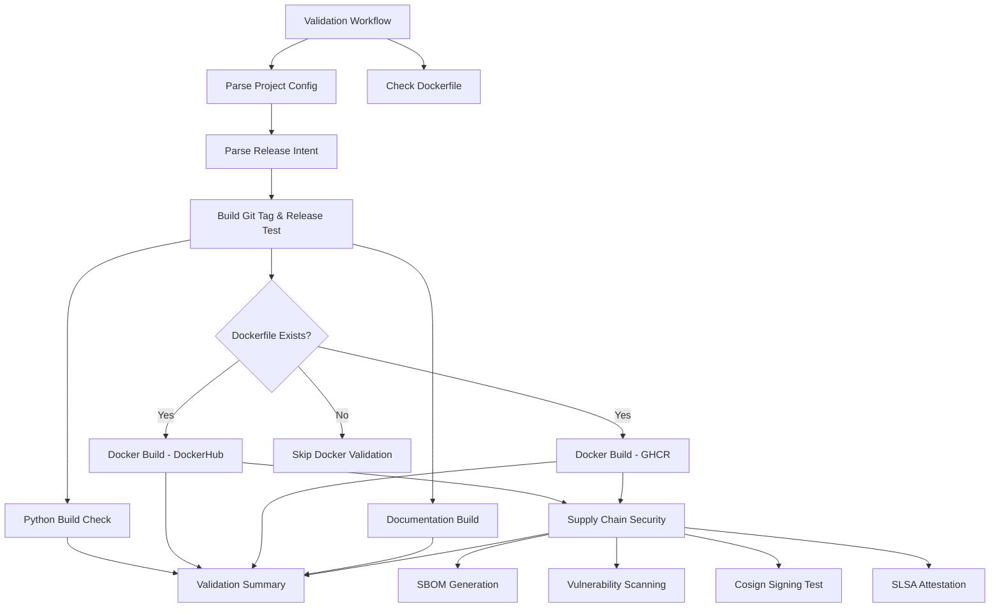

# rw_release_validation_complete.yaml

Pre-release validation workflow that tests all release components without publishing artifacts.

[](https://github.com/Chisanan232/GitHub-Action_Reusable_Workflows-Python/blob/master/.github/workflows/rw_release_validation_complete.yaml)

## Description

This workflow provides comprehensive validation of release artifacts before actual deployment. It tests Python package builds, Docker image builds, documentation generation, and supply chain security without publishing anything to production registries.

## Purpose

- **Pre-Release Testing**: Validate all release components before production deployment
- **Pull Request Validation**: Automatically test releases on PRs to master branch
- **Configuration Testing**: Verify release configuration and intent parsing
- **Security Validation**: Test SBOM generation, vulnerability scanning, and signing
- **Risk Mitigation**: Catch issues early without affecting production artifacts

## Inputs

| Parameter | Type | Required | Default | Description |
|-----------|------|----------|---------|-------------|
| `level` | string | No | `auto` | Release level to test (`auto`, `patch`, `minor`, `major`) |
| `python` | string | No | `auto` | Python package validation (`auto`, `force`, `skip`) |
| `docker` | string | No | `auto` | Docker image validation (`auto`, `force`, `skip`) |
| `docs` | string | No | `auto` | Documentation validation (`auto`, `force`, `skip`) |

## Outputs

| Output | Description |
|--------|-------------|
| `validation_passed` | Whether all validation checks passed |
| `intent_parsed` | Release intent parsing result |
| `python_validated` | Python package validation result |
| `docker_validated` | Docker validation result |
| `docs_validated` | Documentation validation result |
| `security_validated` | Security validation result |

## Workflow Architecture



## Validation Steps

### 1. Configuration Parsing & Validation

```yaml
config:
  name: Parse Configuration
  uses: ./.github/workflows/rw_parse_project_config.yaml
```

**Validates:**
- Enhanced `intent.yaml` structure and syntax
- Config output generation for all sections
- Auto-detection logic for project and package names
- Docker registry URLs and health check configurations
- Documentation path accessibility

### 2. Dockerfile Detection

```yaml
check-dockerfile:
  name: Check Dockerfile Exists
  runs-on: ubuntu-latest
  outputs:
    has_dockerfile: ${{ steps.check.outputs.has_dockerfile }}
```

**Purpose:**
- Validates Dockerfile presence before Docker validation steps
- Prevents validation failures for Python-only projects
- Provides clear skip messages when no Dockerfile found
- Enables conditional execution of Docker-related jobs

### 3. Release Intent Validation

```yaml
intent-parse:
  uses: ./.github/workflows/rw_parse_release_intent.yaml
  needs: config
  with:
    level: ${{ inputs.level }}
    python: ${{ inputs.python }}
    docker: ${{ inputs.docker }}
    docs: ${{ inputs.docs }}
```

**Validates:**
- Enhanced JSON schema validation
- Release intent against config-provided defaults
- Artifact configuration with enhanced format support
- Version bump level settings
- Release notes format

### 4. Python Package Build Check

**Tests:**
- Package builds successfully with `uv build`
- All dependencies resolve correctly
- Package metadata is valid
- Distribution files are created
- No build errors or warnings

**Validation Process:**
```bash
# Build package
uv build

# Verify dist files
ls -la dist/

# Check package metadata
tar -tzf dist/*.tar.gz
```

### 5. Docker Image Build Validation

**Only runs if Dockerfile exists**

#### DockerHub Build Test

```yaml
docker-build-dockerhub:
  if: needs.check-dockerfile.outputs.has_dockerfile == 'true'
  uses: ./.github/workflows/rw_docker_operations.yaml
  with:
    operation: 'build'
    registry: ${{ needs.config.outputs.docker_registry_dockerhub }}
```

**Tests:**
- Docker image builds successfully
- Multi-architecture support (amd64, arm64)
- Image layers are optimized
- Build cache works correctly
- No build errors

#### GHCR Build Test

```yaml
docker-build-ghcr:
  if: needs.check-dockerfile.outputs.has_dockerfile == 'true'
  uses: ./.github/workflows/rw_docker_operations.yaml
  with:
    operation: 'build'
    registry: ${{ needs.config.outputs.docker_registry_ghcr }}
```

**Tests:**
- GHCR-specific build configuration
- Registry authentication setup
- Image tagging conventions
- Metadata labels

### 6. Documentation Build Test

```yaml
docs-build:
  uses: ./.github/workflows/rw_docs_operations.yaml
  with:
    operation: 'build'
```

**Tests:**
- Docusaurus builds successfully
- All MDX files are valid
- No broken links
- Search index generation
- Multi-section documentation support

### 7. Supply Chain Security Validation

**Only runs if Dockerfile exists**

```yaml
supply-chain-loopback:
  if: needs.check-dockerfile.outputs.has_dockerfile == 'true'
  needs: [docker-build-dockerhub, docker-build-ghcr]
```

#### SBOM Generation Test

**Tool:** Syft

**Validates:**
- SBOM generation for Docker images
- Fallback SBOM from workspace
- SBOM format (SPDX, CycloneDX)
- Component inventory completeness

#### Vulnerability Scanning Test

**Tool:** Grype

**Validates:**
- CVE detection in dependencies
- Vulnerability severity assessment
- Security scan report generation
- Defensive checks for missing images

#### Cosign Signing Test

**Validates:**
- Keyless signing with GitHub OIDC
- Signature generation
- Signature verification
- Cosign integration

#### SLSA Attestation Test

**Validates:**
- Provenance attestation generation
- Build metadata capture
- Attestation format compliance
- Supply chain transparency

## Validation Summary

The workflow generates a comprehensive validation summary:

```
=== Release Validation Summary ===
✅ Configuration Parsing: Success
✅ Release Intent Validation: Success
✅ Python Package Build: Success
✅ Docker Build (DockerHub): Success
✅ Docker Build (GHCR): Success
✅ Documentation Build: Success
✅ SBOM Generation: Success
✅ Vulnerability Scanning: Success
✅ Cosign Signing: Success
✅ SLSA Attestation: Success

Overall Result: ✅ All Validations Passed
```

Or for Python-only projects:

```
=== Release Validation Summary ===
✅ Configuration Parsing: Success
✅ Release Intent Validation: Success
✅ Python Package Build: Success
⏭️ Docker Build: Skipped (no Dockerfile)
✅ Documentation Build: Success
⏭️ Supply Chain Security: Skipped (no Docker)

Overall Result: ✅ All Validations Passed
```

## Usage Examples

### Basic Validation

```yaml
jobs:
  validate:
    uses: Chisanan232/GitHub-Action_Reusable_Workflows-Python/.github/workflows/rw_release_validation_complete.yaml@master
```

### Custom Validation Configuration

```yaml
jobs:
  validate:
    uses: Chisanan232/GitHub-Action_Reusable_Workflows-Python/.github/workflows/rw_release_validation_complete.yaml@master
    with:
      level: 'minor'
      python: 'force'
      docker: 'auto'
      docs: 'force'
```

### Pull Request Validation

```yaml
name: PR Validation

on:
  pull_request:
    branches: [master]

jobs:
  validate-release:
    uses: Chisanan232/GitHub-Action_Reusable_Workflows-Python/.github/workflows/rw_release_validation_complete.yaml@master
    with:
      level: 'auto'
```

## Automatic Dockerfile Detection

The validation workflow automatically detects Dockerfile presence:

- ✅ **Dockerfile exists**: All validation steps run
- ⚠️ **No Dockerfile**: Docker and security steps are skipped
- 📋 **Clear logging**: Workflow indicates which steps were skipped

**Benefits:**
- Works for both Docker-based and Python-only projects
- No manual configuration needed
- Prevents false validation failures
- Clear feedback on what was validated

## Security Validation Features

### Defensive Checks

- Pre-flight image existence validation
- Fallback SBOM generation from workspace
- Clear error messages for missing components
- Graceful handling of scan failures

### Comprehensive Coverage

- **SBOM**: Complete software bill of materials
- **CVE Detection**: Known vulnerability scanning
- **Signing**: Digital signature verification
- **Attestation**: Build provenance tracking

## Best Practices

### 1. Run on Pull Requests

Always validate releases before merging:

```yaml
on:
  pull_request:
    branches: [master]
```

### 2. Review Validation Results

Check the validation summary and individual job results before merging.

### 3. Test Configuration Changes

When modifying `intent.yaml`, run validation to ensure changes are valid.

### 4. Monitor Security Scans

Review vulnerability scan results and address critical issues.

### 5. Validate Before Staging

Run validation before deploying to staging environments.

## Troubleshooting

### Validation Failures

**Configuration Parsing Failed:**
- Check `intent.yaml` syntax
- Verify JSON schema compliance
- Review error messages in logs

**Python Build Failed:**
- Check `pyproject.toml` configuration
- Verify dependencies are resolvable
- Review build logs for errors

**Docker Build Failed:**
- Verify Dockerfile syntax
- Check base image availability
- Review Docker build logs

**Documentation Build Failed:**
- Check MDX file syntax
- Verify all links are valid
- Review Docusaurus configuration

**Security Scan Failed:**
- Review vulnerability scan results
- Check SBOM generation logs
- Verify image exists before scanning

### Docker Validation Skipped

If Docker validation is unexpectedly skipped:

1. Verify `Dockerfile` exists in repository root
2. Check the "Dockerfile Check" step in logs
3. Ensure Dockerfile is committed to branch
4. Review validation configuration

## Related Documentation

- [Production Release Workflow](./rw_release_complete.mdx) - Production deployment
- [Staging Release Workflow](./rw_release_staging_complete.mdx) - Staging deployment
- [Release Intent Configuration](./release-intent-configuration.mdx) - intent.yaml configuration guide
