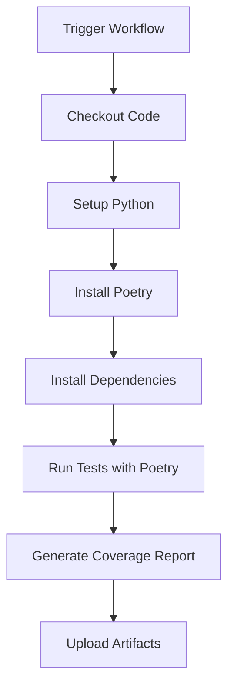

# Poetry Run Test Workflow

[](https://github.com/Chisanan232/GitHub-Action_Reusable_Workflows-Python/blob/master/.github/workflows/rw_poetry_run_test.yaml)

Run Python tests using Poetry dependency management with a single Python version.

## Overview

This workflow executes Python tests using Poetry for dependency management. It's designed for projects that use Poetry as their package manager and need to run tests with a specific Python version.

## When to Use

- ✅ Your project uses Poetry for dependency management
- ✅ You need to test with a single Python version
- ✅ You want Poetry to manage test dependencies
- ✅ You prefer Poetry's virtual environment handling

## Workflow Architecture



## Inputs

### Required Inputs

| Input | Type | Description |
|-------|------|-------------|
| `python_version` | string | Python version to use (e.g., '3.11', '3.12') |
| `test_type` | string | Type of tests to run (e.g., 'unit-test', 'integration-test') |
| `all_test_items_paths` | string | Paths to test files or directories |

### Optional Inputs

| Input | Type | Default | Description |
|-------|------|---------|-------------|
| `poetry_version` | string | `'latest'` | Poetry version to install |
| `pytest_args` | string | `''` | Additional pytest arguments |
| `coverage_format` | string | `'xml'` | Coverage report format (xml, html, term) |

## Outputs

| Output | Description |
|--------|-------------|
| `coverage_report` | Path to generated coverage report |
| `test_results` | Test execution results summary |

## Usage Examples

### Basic Usage

```yaml
name: CI

on: [push, pull_request]

jobs:
  test:
    uses: Chisanan232/GitHub-Action_Reusable_Workflows-Python/.github/workflows/rw_poetry_run_test.yaml@master
    with:
      python_version: '3.11'
      test_type: unit-test
      all_test_items_paths: test/unit_test/
```

### With Custom Poetry Version

```yaml
jobs:
  test:
    uses: Chisanan232/GitHub-Action_Reusable_Workflows-Python/.github/workflows/rw_poetry_run_test.yaml@master
    with:
      python_version: '3.12'
      test_type: integration-test
      all_test_items_paths: test/integration_test/
      poetry_version: '1.7.0'
```

### With Additional Pytest Arguments

```yaml
jobs:
  test:
    uses: Chisanan232/GitHub-Action_Reusable_Workflows-Python/.github/workflows/rw_poetry_run_test.yaml@master
    with:
      python_version: '3.11'
      test_type: unit-test
      all_test_items_paths: test/unit_test/
      pytest_args: '-v --tb=short --strict-markers'
```

### Complete CI Pipeline

```yaml
name: Complete CI

on: [push, pull_request]

jobs:
  unit-tests:
    uses: Chisanan232/GitHub-Action_Reusable_Workflows-Python/.github/workflows/rw_poetry_run_test.yaml@master
    with:
      python_version: '3.11'
      test_type: unit-test
      all_test_items_paths: test/unit_test/
      coverage_format: xml

  integration-tests:
    uses: Chisanan232/GitHub-Action_Reusable_Workflows-Python/.github/workflows/rw_poetry_run_test.yaml@master
    with:
      python_version: '3.11'
      test_type: integration-test
      all_test_items_paths: test/integration_test/
      pytest_args: '-v --maxfail=1'
```

## How It Works

### Step 1: Environment Setup

The workflow sets up the Python environment and installs Poetry:

```yaml
- uses: actions/checkout@v4
- uses: actions/setup-python@v5
  with:
    python-version: ${{ inputs.python_version }}
- uses: snok/install-poetry@v1
  with:
    version: ${{ inputs.poetry_version }}
```

### Step 2: Dependency Installation

Poetry installs all dependencies from `pyproject.toml`:

```bash
poetry install --with dev
```

### Step 3: Test Execution

Runs tests using Poetry's virtual environment:

```bash
poetry run pytest ${{ inputs.all_test_items_paths }} \
  --cov \
  --cov-report=${{ inputs.coverage_format }} \
  ${{ inputs.pytest_args }}
```

### Step 4: Artifact Upload

Uploads coverage reports and test results as artifacts.

## Project Requirements

### pyproject.toml Configuration

Your project must have a `pyproject.toml` file:

```toml
[tool.poetry]
name = "my-project"
version = "0.1.0"
description = "My Python project"

[tool.poetry.dependencies]
python = "^3.11"

[tool.poetry.group.dev.dependencies]
pytest = "^7.4.0"
pytest-cov = "^4.1.0"

[build-system]
requires = ["poetry-core"]
build-backend = "poetry.core.masonry.api"
```

### Test Structure

Organize tests in a clear directory structure:

```
project/
├── pyproject.toml
├── poetry.lock
├── src/
│   └── my_package/
│       └── __init__.py
└── test/
    ├── unit_test/
    │   └── test_module.py
    └── integration_test/
        └── test_integration.py
```

## Best Practices

### 1. Lock File Management

Always commit `poetry.lock` to ensure reproducible builds:

```bash
git add poetry.lock
git commit -m "Update dependencies"
```

### 2. Dependency Groups

Use Poetry dependency groups for test dependencies:

```toml
[tool.poetry.group.dev.dependencies]
pytest = "^7.4.0"
pytest-cov = "^4.1.0"
pytest-mock = "^3.11.0"
```

### 3. Coverage Configuration

Configure coverage in `pyproject.toml`:

```toml
[tool.coverage.run]
source = ["src"]
omit = ["*/tests/*", "*/test_*.py"]

[tool.coverage.report]
exclude_lines = [
    "pragma: no cover",
    "def __repr__",
    "raise NotImplementedError",
]
```

### 4. Pytest Configuration

Configure pytest in `pyproject.toml`:

```toml
[tool.pytest.ini_options]
testpaths = ["test"]
python_files = "test_*.py"
python_classes = "Test*"
python_functions = "test_*"
addopts = "-v --strict-markers"
```

## Troubleshooting

### Poetry Installation Fails

**Symptoms:**
- Poetry installation errors
- Version conflicts

**Solutions:**
1. Specify exact Poetry version:
   ```yaml
   poetry_version: '1.7.0'
   ```
2. Check Python version compatibility
3. Review Poetry installation logs

### Dependency Installation Fails

**Symptoms:**
- `poetry install` fails
- Lock file conflicts

**Solutions:**
1. Update `poetry.lock`:
   ```bash
   poetry lock --no-update
   ```
2. Check dependency compatibility
3. Review `pyproject.toml` syntax

### Tests Not Found

**Symptoms:**
- "No tests collected" error
- Pytest can't find tests

**Solutions:**
1. Verify test path is correct:
   ```yaml
   all_test_items_paths: test/unit_test/
   ```
2. Check test file naming (must start with `test_`)
3. Ensure `__init__.py` files exist in test directories

### Coverage Report Missing

**Symptoms:**
- No coverage report generated
- Coverage artifact not uploaded

**Solutions:**
1. Verify pytest-cov is installed
2. Check coverage configuration
3. Ensure tests actually run

## Comparison with Other Test Workflows

| Feature | rw_poetry_run_test | rw_run_test | rw_poetry_run_test_with_multi_py_versions |
|---------|-------------------|-------------|------------------------------------------|
| Dependency Manager | Poetry | pip/uv | Poetry |
| Python Versions | Single | Single | Multiple |
| Lock File | poetry.lock | requirements.txt | poetry.lock |
| Virtual Env | Poetry managed | Actions managed | Poetry managed |
| Best For | Poetry projects | Simple projects | Poetry + multi-version |

## Related Workflows

- [rw_run_test](rw_run_test.mdx) - Run tests without Poetry
- [rw_poetry_run_test_with_multi_py_versions](rw_poetry_run_test_with_multi_py_versions.mdx) - Poetry with multiple Python versions
- [rw_get_tests](rw_get_tests.mdx) - Discover test items
- [rw_upload_test_cov_report](../rw_upload_test_cov_report.mdx) - Upload coverage reports

## Additional Resources

- [Poetry Documentation](https://python-poetry.org/docs/)
- [Pytest Documentation](https://docs.pytest.org/)
- [pytest-cov Documentation](https://pytest-cov.readthedocs.io/)
