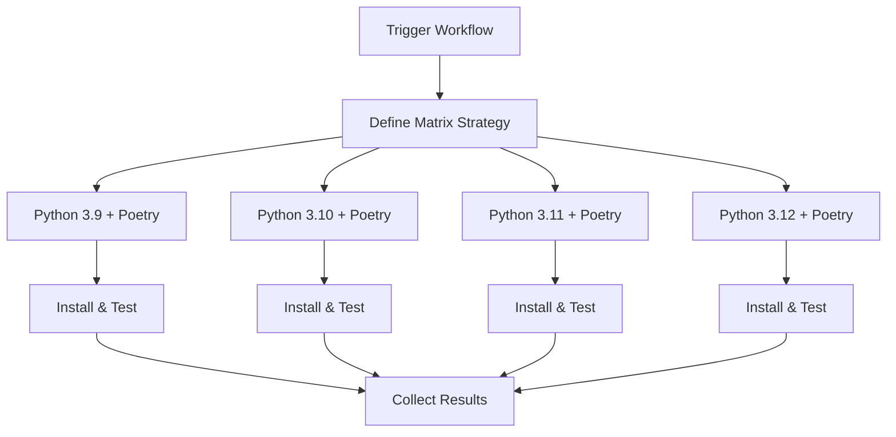

# Poetry Multi-Version Test Workflow

[](https://github.com/Chisanan232/GitHub-Action_Reusable_Workflows-Python/blob/master/.github/workflows/rw_poetry_run_test_with_multi_py_versions.yaml)

Run Python tests using Poetry across multiple Python versions simultaneously.

## Overview

This workflow combines Poetry dependency management with multi-version testing, executing tests across multiple Python versions in parallel using GitHub Actions matrix strategy.

## When to Use

- ✅ Your project uses Poetry for dependency management
- ✅ You need to test compatibility across multiple Python versions
- ✅ You want Poetry to manage dependencies for all test versions
- ✅ You need parallel test execution with consistent dependency resolution

## Workflow Architecture



## Inputs

### Required Inputs

| Input | Type | Description |
|-------|------|-------------|
| `test_type` | string | Type of tests to run |
| `all_test_items_paths` | string | Paths to test files or directories |

### Optional Inputs

| Input | Type | Default | Description |
|-------|------|---------|-------------|
| `python_versions` | string | `'["3.9", "3.10", "3.11", "3.12"]'` | JSON array of Python versions |
| `poetry_version` | string | `'latest'` | Poetry version to install |
| `pytest_args` | string | `''` | Additional pytest arguments |
| `fail_fast` | boolean | `false` | Stop all jobs if one fails |

## Outputs

| Output | Description |
|--------|-------------|
| `test_matrix_results` | Results from all Python versions |
| `combined_coverage` | Combined coverage from all versions |

## Usage Examples

### Basic Usage

```yaml
name: CI

on: [push, pull_request]

jobs:
  test:
    uses: Chisanan232/GitHub-Action_Reusable_Workflows-Python/.github/workflows/rw_poetry_run_test_with_multi_py_versions.yaml@master
    with:
      test_type: unit-test
      all_test_items_paths: test/unit_test/
```

### Custom Python Versions

```yaml
jobs:
  test:
    uses: Chisanan232/GitHub-Action_Reusable_Workflows-Python/.github/workflows/rw_poetry_run_test_with_multi_py_versions.yaml@master
    with:
      test_type: unit-test
      all_test_items_paths: test/unit_test/
      python_versions: '["3.11", "3.12"]'
      poetry_version: '1.7.0'
```

### Complete CI Pipeline

```yaml
name: Complete CI

on: [push, pull_request]

jobs:
  unit-tests:
    uses: Chisanan232/GitHub-Action_Reusable_Workflows-Python/.github/workflows/rw_poetry_run_test_with_multi_py_versions.yaml@master
    with:
      test_type: unit-test
      all_test_items_paths: test/unit_test/
      python_versions: '["3.10", "3.11", "3.12"]'

  integration-tests:
    needs: unit-tests
    uses: Chisanan232/GitHub-Action_Reusable_Workflows-Python/.github/workflows/rw_poetry_run_test_with_multi_py_versions.yaml@master
    with:
      test_type: integration-test
      all_test_items_paths: test/integration_test/
      python_versions: '["3.11", "3.12"]'
      pytest_args: '-v --maxfail=1'
```

## How It Works

### Step 1: Matrix Setup

Creates a matrix of Python versions with Poetry:

```yaml
strategy:
  matrix:
    python-version: ${{ fromJson(inputs.python_versions) }}
  fail-fast: ${{ inputs.fail_fast }}
```

### Step 2: Environment Setup

For each Python version:

```yaml
- uses: actions/setup-python@v5
  with:
    python-version: ${{ matrix.python-version }}

- uses: snok/install-poetry@v1
  with:
    version: ${{ inputs.poetry_version }}
```

### Step 3: Dependency Installation

Poetry installs dependencies for each version:

```bash
poetry install --with dev
```

### Step 4: Test Execution

Runs tests using Poetry:

```bash
poetry run pytest ${{ inputs.all_test_items_paths }} \
  --cov \
  --cov-report=xml:coverage-${{ matrix.python-version }}.xml \
  ${{ inputs.pytest_args }}
```

## Project Requirements

### pyproject.toml Configuration

Configure Python version compatibility:

```toml
[tool.poetry]
name = "my-project"
version = "0.1.0"

[tool.poetry.dependencies]
python = "^3.9"  # Supports 3.9+

[tool.poetry.group.dev.dependencies]
pytest = "^7.4.0"
pytest-cov = "^4.1.0"
```

### Version-Specific Dependencies

Handle version-specific requirements:

```toml
[tool.poetry.dependencies]
python = "^3.9"
typing-extensions = {version = "^4.0", python = "<3.10"}
```

## Best Practices

### 1. Version Compatibility

Define compatible Python versions:

```toml
[tool.poetry.dependencies]
python = ">=3.9,<3.13"
```

### 2. Lock File Management

Ensure `poetry.lock` is committed:

```bash
poetry lock --no-update
git add poetry.lock
```

### 3. Dependency Groups

Organize test dependencies:

```toml
[tool.poetry.group.test.dependencies]
pytest = "^7.4.0"
pytest-cov = "^4.1.0"
pytest-asyncio = "^0.21.0"
```

### 4. Coverage Configuration

Configure coverage in `pyproject.toml`:

```toml
[tool.coverage.run]
source = ["src"]
parallel = true

[tool.coverage.report]
precision = 2
```

## Troubleshooting

### Poetry Lock File Conflicts

**Symptoms:**
- Lock file errors across versions
- Dependency resolution failures

**Solutions:**
1. Update lock file:
   ```bash
   poetry lock --no-update
   ```

2. Check version constraints:
   ```toml
   python = "^3.9"  # Ensure compatible
   ```

### Version-Specific Test Failures

**Symptoms:**
- Tests pass on some versions, fail on others

**Solutions:**
1. Use version markers:
   ```python
   import sys
   import pytest
   
   @pytest.mark.skipif(sys.version_info < (3, 10), reason="Requires Python 3.10+")
   def test_new_feature():
       pass
   ```

2. Check dependency compatibility

### Matrix Job Timeouts

**Symptoms:**
- Jobs timeout on specific versions

**Solutions:**
1. Reduce matrix size
2. Enable fail-fast for debugging
3. Check resource usage

## Related Workflows

- [rw_poetry_run_test](rw_poetry_run_test.mdx) - Poetry single version
- [rw_run_test_with_multi_py_versions](rw_run_test_with_multi_py_versions.mdx) - Multi-version without Poetry
- [rw_get_tests](rw_get_tests.mdx) - Discover test items
- [rw_upload_test_cov_report](../coverage_report/rw_upload_test_cov_report.mdx) - Upload coverage

## Additional Resources

- [Poetry Documentation](https://python-poetry.org/docs/)
- [Poetry Version Constraints](https://python-poetry.org/docs/dependency-specification/)
- [GitHub Actions Matrix](https://docs.github.com/en/actions/using-jobs/using-a-matrix-for-your-jobs)
