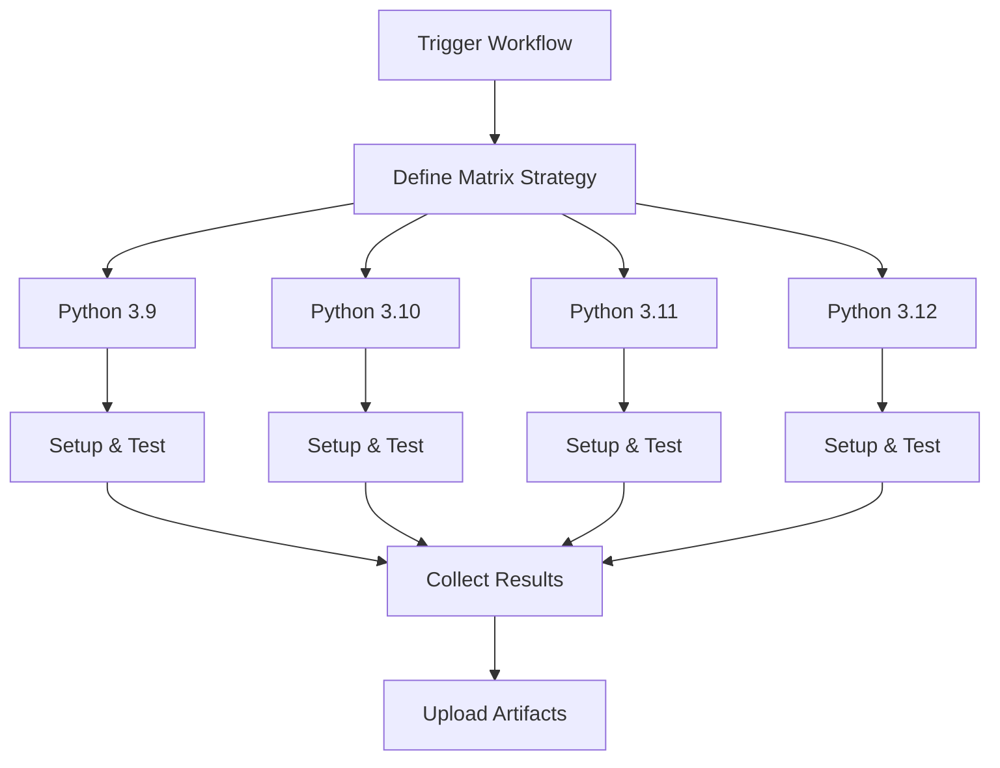

# Multi-Version Test Workflow

[](https://github.com/Chisanan232/GitHub-Action_Reusable_Workflows-Python/blob/master/.github/workflows/rw_run_test_with_multi_py_versions.yaml)

Run Python tests across multiple Python versions simultaneously using matrix strategy.

## Overview

This workflow executes Python tests across multiple Python versions in parallel, ensuring your code works correctly across different Python environments. It uses GitHub Actions matrix strategy for efficient parallel execution.

## When to Use

- ✅ You need to test compatibility across multiple Python versions
- ✅ You want to ensure broad Python version support
- ✅ You need parallel test execution for faster CI
- ✅ You're preparing for a release and need comprehensive testing

## Workflow Architecture



## Inputs

### Required Inputs

| Input | Type | Description |
|-------|------|-------------|
| `test_type` | string | Type of tests to run (e.g., 'unit-test', 'integration-test') |
| `all_test_items_paths` | string | Paths to test files or directories |

### Optional Inputs

| Input | Type | Default | Description |
|-------|------|---------|-------------|
| `python_versions` | string | `'["3.9", "3.10", "3.11", "3.12"]'` | JSON array of Python versions |
| `pytest_args` | string | `''` | Additional pytest arguments |
| `fail_fast` | boolean | `false` | Stop all jobs if one fails |
| `coverage_combine` | boolean | `true` | Combine coverage from all versions |

## Outputs

| Output | Description |
|--------|-------------|
| `test_matrix_results` | Results from all Python versions |
| `combined_coverage` | Combined coverage report from all versions |

## Usage Examples

### Basic Multi-Version Testing

```yaml
name: CI

on: [push, pull_request]

jobs:
  test:
    uses: Chisanan232/GitHub-Action_Reusable_Workflows-Python/.github/workflows/rw_run_test_with_multi_py_versions.yaml@master
    with:
      test_type: unit-test
      all_test_items_paths: test/unit_test/
```

### Custom Python Versions

```yaml
jobs:
  test:
    uses: Chisanan232/GitHub-Action_Reusable_Workflows-Python/.github/workflows/rw_run_test_with_multi_py_versions.yaml@master
    with:
      test_type: unit-test
      all_test_items_paths: test/unit_test/
      python_versions: '["3.10", "3.11", "3.12"]'
```

### With Fail-Fast Strategy

```yaml
jobs:
  test:
    uses: Chisanan232/GitHub-Action_Reusable_Workflows-Python/.github/workflows/rw_run_test_with_multi_py_versions.yaml@master
    with:
      test_type: integration-test
      all_test_items_paths: test/integration_test/
      fail_fast: true  # Stop all if one fails
```

### Complete CI with Multiple Test Types

```yaml
name: Complete CI

on: [push, pull_request]

jobs:
  unit-tests:
    uses: Chisanan232/GitHub-Action_Reusable_Workflows-Python/.github/workflows/rw_run_test_with_multi_py_versions.yaml@master
    with:
      test_type: unit-test
      all_test_items_paths: test/unit_test/
      python_versions: '["3.10", "3.11", "3.12"]'

  integration-tests:
    needs: unit-tests
    uses: Chisanan232/GitHub-Action_Reusable_Workflows-Python/.github/workflows/rw_run_test_with_multi_py_versions.yaml@master
    with:
      test_type: integration-test
      all_test_items_paths: test/integration_test/
      python_versions: '["3.11", "3.12"]'
      pytest_args: '-v --maxfail=1'
```

## How It Works

### Step 1: Matrix Strategy Setup

The workflow creates a matrix of Python versions:

```yaml
strategy:
  matrix:
    python-version: ${{ fromJson(inputs.python_versions) }}
  fail-fast: ${{ inputs.fail_fast }}
```

### Step 2: Parallel Execution

Each Python version runs independently in parallel:

```yaml
- uses: actions/setup-python@v5
  with:
    python-version: ${{ matrix.python-version }}

- name: Install dependencies
  run: |
    python -m pip install --upgrade pip
    pip install pytest pytest-cov

- name: Run tests
  run: |
    pytest ${{ inputs.all_test_items_paths }} \
      --cov \
      --cov-report=xml:coverage-${{ matrix.python-version }}.xml
```

### Step 3: Coverage Combination

If enabled, combines coverage from all versions:

```yaml
- name: Combine coverage
  if: inputs.coverage_combine
  run: |
    coverage combine coverage-*.xml
    coverage report
```

## Matrix Strategy Configuration

### Default Python Versions

By default, tests run on:
- Python 3.9
- Python 3.10
- Python 3.11
- Python 3.12

### Custom Version Matrix

Specify your own versions:

```yaml
# Only latest versions
python_versions: '["3.11", "3.12"]'

# Include pre-release
python_versions: '["3.11", "3.12", "3.13-dev"]'

# Specific minor versions
python_versions: '["3.10.11", "3.11.5", "3.12.0"]'
```

### Operating System Matrix

Combine with OS matrix for comprehensive testing:

```yaml
jobs:
  test:
    strategy:
      matrix:
        os: [ubuntu-latest, windows-latest, macos-latest]
        python-version: ["3.10", "3.11", "3.12"]
    runs-on: ${{ matrix.os }}
    steps:
      - uses: Chisanan232/GitHub-Action_Reusable_Workflows-Python/.github/workflows/rw_run_test_with_multi_py_versions.yaml@master
        with:
          test_type: unit-test
          all_test_items_paths: test/unit_test/
```

## Best Practices

### 1. Version Selection

Choose Python versions strategically:

```yaml
# Minimum: Current + Previous
python_versions: '["3.11", "3.12"]'

# Standard: Last 3 versions
python_versions: '["3.10", "3.11", "3.12"]'

# Comprehensive: All supported versions
python_versions: '["3.9", "3.10", "3.11", "3.12"]'
```

### 2. Fail-Fast Strategy

Use fail-fast for faster feedback:

```yaml
# Development: Fail fast
fail_fast: true

# CI/CD: Run all versions
fail_fast: false
```

### 3. Coverage Combination

Combine coverage for accurate metrics:

```yaml
coverage_combine: true  # Recommended for accurate coverage
```

### 4. Version-Specific Dependencies

Handle version-specific dependencies:

```python
# setup.py or pyproject.toml
install_requires=[
    "package>=1.0; python_version>='3.10'",
    "package<1.0; python_version<'3.10'",
]
```

## Troubleshooting

### Version-Specific Failures

**Symptoms:**
- Tests pass on some versions, fail on others
- Import errors on specific Python versions

**Solutions:**
1. Check version-specific syntax:
   ```python
   # Python 3.10+ only
   match value:
       case 1:
           pass
   ```

2. Use version checks:
   ```python
   import sys
   if sys.version_info >= (3, 10):
       # Python 3.10+ code
   ```

3. Review dependency compatibility

### Matrix Job Failures

**Symptoms:**
- All matrix jobs fail
- Timeout errors

**Solutions:**
1. Reduce matrix size:
   ```yaml
   python_versions: '["3.11", "3.12"]'
   ```

2. Enable fail-fast for debugging:
   ```yaml
   fail_fast: true
   ```

3. Check resource limits

### Coverage Combination Issues

**Symptoms:**
- Combined coverage is incorrect
- Missing coverage data

**Solutions:**
1. Ensure consistent source paths
2. Check coverage configuration:
   ```toml
   [tool.coverage.paths]
   source = ["src", "*/site-packages"]
   ```

3. Verify all jobs complete successfully

## Performance Optimization

### 1. Caching Dependencies

Cache pip packages for faster runs:

```yaml
- uses: actions/cache@v4
  with:
    path: ~/.cache/pip
    key: ${{ runner.os }}-pip-${{ hashFiles('**/requirements.txt') }}
```

### 2. Parallel Execution

Maximize parallelism:

```yaml
# Run all versions in parallel
fail_fast: false

# Use GitHub's default concurrency
# (typically 20 concurrent jobs for free tier)
```

### 3. Selective Testing

Test different suites on different versions:

```yaml
jobs:
  quick-test:
    # Fast tests on all versions
    with:
      python_versions: '["3.9", "3.10", "3.11", "3.12"]'
      all_test_items_paths: test/unit_test/

  comprehensive-test:
    # Slow tests on latest versions only
    with:
      python_versions: '["3.12"]'
      all_test_items_paths: test/
```

## Comparison with Other Test Workflows

| Feature | rw_run_test_with_multi_py_versions | rw_run_test | rw_poetry_run_test_with_multi_py_versions |
|---------|-----------------------------------|-------------|------------------------------------------|
| Python Versions | Multiple (parallel) | Single | Multiple (parallel) |
| Dependency Manager | pip/uv | pip/uv | Poetry |
| Execution Speed | Fast (parallel) | Fastest (single) | Fast (parallel) |
| Coverage Combination | Yes | N/A | Yes |
| Best For | Multi-version support | Single version | Poetry + multi-version |

## Related Workflows

- [rw_run_test](rw_run_test.mdx) - Single Python version testing
- [rw_poetry_run_test_with_multi_py_versions](rw_poetry_run_test_with_multi_py_versions.mdx) - Poetry with multiple versions
- [rw_get_tests](rw_get_tests.mdx) - Discover test items
- [rw_upload_test_cov_report](../coverage_report/rw_upload_test_cov_report.mdx) - Upload coverage reports

## Additional Resources

- [GitHub Actions Matrix Strategy](https://docs.github.com/en/actions/using-jobs/using-a-matrix-for-your-jobs)
- [Python Version Support Policy](https://devguide.python.org/versions/)
- [Coverage.py Documentation](https://coverage.readthedocs.io/)
