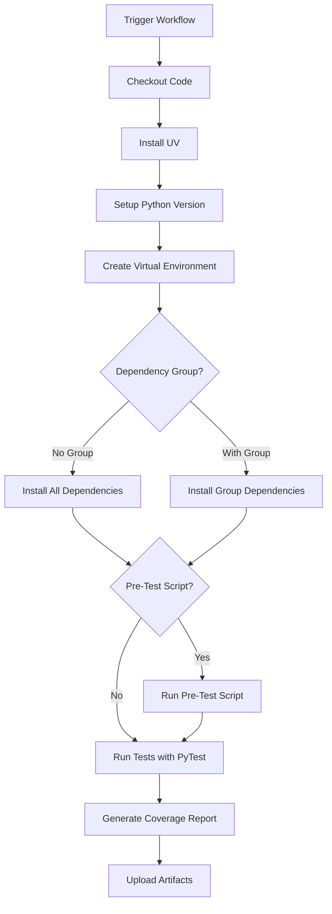

# UV Run Test Workflow

[](https://github.com/Chisanan232/GitHub-Action_Reusable_Workflows-Python/blob/master/.github/workflows/rw_uv_run_test.yaml)

Run Python tests using UV (ultra-fast Python package installer and resolver) with a single or multiple Python versions.

## Overview

This workflow executes Python tests using UV for dependency management. UV is a modern, extremely fast Python package installer and resolver written in Rust, making it significantly faster than traditional pip or Poetry workflows. It's designed for projects that use UV as their package manager and need to run tests efficiently.

## When to Use

- ✅ Your project uses UV for dependency management
- ✅ You need blazing-fast dependency installation
- ✅ You want to test across multiple Python versions and operating systems
- ✅ You prefer modern Python tooling with lockfile support
- ✅ You need efficient CI/CD pipelines with minimal setup time

## Workflow Architecture



## Inputs

### Required Inputs

| Input       | Type   | Description                                                  |
|-------------|--------|--------------------------------------------------------------|
| `test_type` | string | Type of tests to run (e.g., 'unit-test', 'integration-test') |

### Optional Inputs

| Input                           | Type   | Default                                                           | Description                                          |
|---------------------------------|--------|-------------------------------------------------------------------|------------------------------------------------------|
| `test_working_directory`        | string | `'./'`                                                            | Working directory for test execution                 |
| `test_folder`                   | string | `'./test'`                                                        | Folder path for test code                            |
| `all_test_items_paths`          | string | `'["./test"]'`                                                    | JSON array of test paths to execute                  |
| `install_dependency_with_group` | string | `''`                                                              | UV dependency group to install (e.g., 'test', 'dev') |
| `with-environment-variables`    | string | `''`                                                              | Additional environment variables to set              |
| `pre_test_script`               | string | `''`                                                              | Shell script or bash command to run before tests     |
| `max-parallel`                  | number | `0`                                                               | Maximum parallel jobs (0 = unlimited)                |
| `python-versions`               | string | `'["3.13"]'`                                                      | JSON array of Python versions to test                |
| `operating-systems`             | string | `'["ubuntu-latest", "ubuntu-22.04", "macos-latest", "macos-14"]'` | JSON array of OS to test on                          |

### Secrets

| Secret               | Required | Description                              |
|----------------------|----------|------------------------------------------|
| `e2e_test_api_token` | No       | API token for end-to-end tests if needed |

## Outputs

This workflow uploads coverage reports as artifacts:

| Artifact Name                                | Description                      |
|----------------------------------------------|----------------------------------|
| `coverage_<test_type>_<os>_<python_version>` | Coverage report file (.coverage) |

## Usage Examples

### Basic Usage

```yaml
name: CI

on: [push, pull_request]

jobs:
  test:
    uses: Chisanan232/GitHub-Action_Reusable_Workflows-Python/.github/workflows/rw_uv_run_test.yaml@master
    with:
      test_type: unit-test
      all_test_items_paths: '["./test/unit_test/"]'
```

### Multi-Version Testing

```yaml
jobs:
  test:
    uses: Chisanan232/GitHub-Action_Reusable_Workflows-Python/.github/workflows/rw_uv_run_test.yaml@master
    with:
      test_type: unit-test
      python-versions: '["3.11", "3.12", "3.13"]'
      operating-systems: '["ubuntu-latest", "macos-latest", "windows-latest"]'
      all_test_items_paths: '["./test/unit_test/"]'
```

### With Dependency Groups

```yaml
jobs:
  test:
    uses: Chisanan232/GitHub-Action_Reusable_Workflows-Python/.github/workflows/rw_uv_run_test.yaml@master
    with:
      test_type: integration-test
      install_dependency_with_group: test
      test_working_directory: ./
      all_test_items_paths: '["./test/integration_test/"]'
```

### With Environment Variables

```yaml
jobs:
  test:
    uses: Chisanan232/GitHub-Action_Reusable_Workflows-Python/.github/workflows/rw_uv_run_test.yaml@master
    with:
      test_type: unit-test
      with-environment-variables: 'DEBUG=1 LOG_LEVEL=debug'
      all_test_items_paths: '["./test/"]'
```

### With Pre-Test Script

```yaml
jobs:
  test:
    uses: Chisanan232/GitHub-Action_Reusable_Workflows-Python/.github/workflows/rw_uv_run_test.yaml@master
    with:
      test_type: unit-test
      pre_test_script: |
        echo "Running pre-test validation..."
        curl -s https://slack.com/api/auth.test -H "Authorization: Bearer $SLACK_BOT_TOKEN"
      all_test_items_paths: '["./test/unit_test/"]'
```

### End-to-End Testing with Secrets

```yaml
jobs:
  e2e-test:
    uses: Chisanan232/GitHub-Action_Reusable_Workflows-Python/.github/workflows/rw_uv_run_test.yaml@master
    secrets:
      e2e_test_api_token: ${{ secrets.E2E_API_TOKEN }}
    with:
      test_type: e2e-test
      all_test_items_paths: '["./test/e2e/"]'
      python-versions: '["3.13"]'
      pre_test_script: 'echo "Starting E2E tests..." && ./scripts/setup-test-env.sh'
```

### Complete CI Pipeline

```yaml
name: Complete CI

on: [push, pull_request]

jobs:
  unit-tests:
    uses: Chisanan232/GitHub-Action_Reusable_Workflows-Python/.github/workflows/rw_uv_run_test.yaml@master
    with:
      test_type: unit-test
      python-versions: '["3.11", "3.12", "3.13"]'
      operating-systems: '["ubuntu-latest", "macos-latest"]'
      all_test_items_paths: '["./test/unit_test/"]'
      max-parallel: 4

  integration-tests:
    uses: Chisanan232/GitHub-Action_Reusable_Workflows-Python/.github/workflows/rw_uv_run_test.yaml@master
    with:
      test_type: integration-test
      install_dependency_with_group: test
      all_test_items_paths: '["./test/integration_test/"]'
      python-versions: '["3.13"]'
```

## How It Works

### Step 1: Environment Setup

The workflow sets up UV and Python:

```yaml
- uses: astral-sh/setup-uv@v7
  with:
    python-version: ${{ matrix.python-version }}
```

### Step 2: Virtual Environment Creation

Creates a UV-managed virtual environment:

```bash
uv venv
. .venv/bin/activate
```

### Step 3: Dependency Installation

**Option A: Install all dependencies (default)**
```bash
uv sync --locked --all-extras --dev
```

**Option B: Install specific dependency group**
```bash
uv pip install --group=<group-name>
```

### Step 4: Pre-Test Script (Optional)

If `pre_test_script` is provided, runs custom commands before tests:

```bash
# Example: Verify API connectivity
curl -s https://slack.com/api/auth.test -H "Authorization: Bearer $SLACK_BOT_TOKEN"

# Example: Setup test environment
./scripts/setup-test-env.sh
```

**Common use cases:**
- Verify external service connectivity
- Setup test databases or mock servers
- Validate environment variables
- Run database migrations
- Initialize test fixtures

### Step 5: Test Execution

Runs tests using UV's pytest integration:

```bash
E2E_TEST_API_TOKEN=${{ secrets.e2e_test_api_token }} uv run pytest <test-path>
```

### Step 6: Coverage Collection

Renames and uploads coverage reports:

```bash
mv ./.coverage ./.coverage.<test_type>.<os>-<python-version>
```

## Project Requirements

### pyproject.toml Configuration

Your project must have a `pyproject.toml` file with UV configuration:

```toml
[project]
name = "my-project"
version = "0.1.0"
description = "My Python project"
requires-python = ">=3.11"
dependencies = [
    "requests>=2.31.0",
]

[project.optional-dependencies]
test = [
    "pytest>=7.4.0",
    "pytest-cov>=4.1.0",
]
dev = [
    "ruff>=0.1.0",
    "mypy>=1.7.0",
]

[build-system]
requires = ["hatchling"]
build-backend = "hatchling.build"

[tool.uv]
dev-dependencies = [
    "pytest>=7.4.0",
    "pytest-cov>=4.1.0",
]
```

### Test Structure

Organize tests in a clear directory structure:

```
project/
├── pyproject.toml
├── uv.lock
├── src/
│   └── my_package/
│       └── __init__.py
└── test/
    ├── unit_test/
    │   └── test_module.py
    └── integration_test/
        └── test_integration.py
```

## Best Practices

### 1. Lock File Management

Always commit `uv.lock` to ensure reproducible builds:

```bash
uv lock
git add uv.lock
git commit -m "Update dependencies"
```

### 2. Dependency Groups

Use UV dependency groups for test dependencies:

```toml
[tool.uv]
dev-dependencies = [
    "pytest>=7.4.0",
    "pytest-cov>=4.1.0",
    "pytest-mock>=3.11.0",
]
```

### 3. Coverage Configuration

Configure coverage in `pyproject.toml`:

```toml
[tool.coverage.run]
source = ["src"]
omit = ["*/tests/*", "*/test_*.py"]

[tool.coverage.report]
exclude_lines = [
    "pragma: no cover",
    "def __repr__",
    "raise NotImplementedError",
]
```

### 4. Pytest Configuration

Configure pytest in `pyproject.toml`:

```toml
[tool.pytest.ini_options]
testpaths = ["test"]
python_files = "test_*.py"
python_classes = "Test*"
python_functions = "test_*"
addopts = "-v --strict-markers --cov --cov-report=xml"
```

### 5. Matrix Strategy

Optimize test matrix for efficiency:

```yaml
with:
  python-versions: '["3.11", "3.12", "3.13"]'
  operating-systems: '["ubuntu-latest", "macos-latest"]'
  max-parallel: 4  # Limit concurrent jobs
```

## Advantages of UV

### Speed Comparison

| Tool   | Dependency Installation | Virtual Environment |
|--------|-------------------------|---------------------|
| **UV** | ~1-2 seconds            | ~0.5 seconds        |
| Poetry | ~30-60 seconds          | ~5-10 seconds       |
| pip    | ~20-40 seconds          | ~3-5 seconds        |

### Key Benefits

1. **🚀 Blazing Fast**: 10-100x faster than pip/Poetry
2. **🔒 Reliable**: Lockfile support for reproducible builds
3. **🎯 Modern**: Built with Rust for performance
4. **🔄 Compatible**: Works with standard Python packaging
5. **💾 Efficient**: Smart caching and parallel downloads

## Troubleshooting

### UV Installation Fails

**Symptoms:**
- UV setup action fails
- Version conflicts

**Solutions:**
1. Verify UV version in action:
   ```yaml
   uses: astral-sh/setup-uv@v7
   ```
2. Check Python version compatibility
3. Review UV installation logs

### Dependency Installation Fails

**Symptoms:**
- `uv sync` fails
- Lock file conflicts

**Solutions:**
1. Update `uv.lock`:
   ```bash
   uv lock --upgrade
   ```
2. Check dependency compatibility
3. Review `pyproject.toml` syntax

### Tests Not Found

**Symptoms:**
- "No tests collected" error
- Pytest can't find tests

**Solutions:**
1. Verify test path is correct:
   ```yaml
   all_test_items_paths: '["./test/unit_test/"]'
   ```
2. Check test file naming (must start with `test_`)
3. Ensure `__init__.py` files exist in test directories

### Coverage Report Missing

**Symptoms:**
- No coverage report generated
- Coverage artifact not uploaded

**Solutions:**
1. Verify pytest-cov is installed
2. Check coverage configuration in `pyproject.toml`
3. Ensure tests actually run

### Environment Variables Not Set

**Symptoms:**
- Tests fail due to missing environment variables
- API tokens not available

**Solutions:**
1. Use `with-environment-variables` input:
   ```yaml
   with-environment-variables: 'API_KEY=test DEBUG=1'
   ```
2. Pass secrets properly:
   ```yaml
   secrets:
     e2e_test_api_token: ${{ secrets.TOKEN }}
   ```

## Comparison with Other Test Workflows

| Feature            | rw_uv_run_test  | rw_run_test      | rw_poetry_run_test |
|--------------------|-----------------|------------------|--------------------|
| Dependency Manager | UV              | pip/uv           | Poetry             |
| Speed              | ⚡ Fastest       | Fast             | Moderate           |
| Python Versions    | 3.11+           | 3.8+             | 3.8+               |
| Lock File          | uv.lock         | requirements.txt | poetry.lock        |
| Virtual Env        | UV managed      | Actions managed  | Poetry managed     |
| Matrix Testing     | ✅ Built-in      | ✅ Built-in       | ✅ Built-in         |
| Best For           | Modern projects | Simple projects  | Poetry projects    |

## Migration Guide

### From pip to UV

1. **Create pyproject.toml**:
   ```bash
   uv init
   ```

2. **Import requirements**:
   ```bash
   uv add $(cat requirements.txt)
   ```

3. **Update workflow**:
   ```yaml
   # Before
   uses: .../rw_run_test.yaml
   
   # After
   uses: .../rw_uv_run_test.yaml
   ```

### From Poetry to UV

1. **Convert pyproject.toml**:
   ```bash
   # UV can read Poetry's pyproject.toml
   uv sync
   ```

2. **Update workflow**:
   ```yaml
   # Before
   uses: .../rw_poetry_run_test.yaml
   with:
     install_dependency_with_group: test,dev
   
   # After
   uses: .../rw_uv_run_test.yaml
   with:
     install_dependency_with_group: test
   ```

## Related Workflows

- [rw_run_test](rw_run_test.mdx) - Run tests with pip/uv
- [rw_poetry_run_test](rw_poetry_run_test.mdx) - Run tests with Poetry
- [rw_get_tests](rw_get_tests.mdx) - Discover test items
- [rw_organize_test_cov_reports](../coverage_report/rw_organize_test_cov_reports.mdx) - Organize coverage reports
- [rw_upload_test_cov_report](../coverage_report/rw_upload_test_cov_report.mdx) - Upload coverage reports

## Additional Resources

- [UV Documentation](https://github.com/astral-sh/uv)
- [UV Python Packaging Guide](https://docs.astral.sh/uv/)
- [Pytest Documentation](https://docs.pytest.org/)
- [pytest-cov Documentation](https://pytest-cov.readthedocs.io/)
- [GitHub Actions Matrix Strategy](https://docs.github.com/en/actions/using-jobs/using-a-matrix-for-your-jobs)
